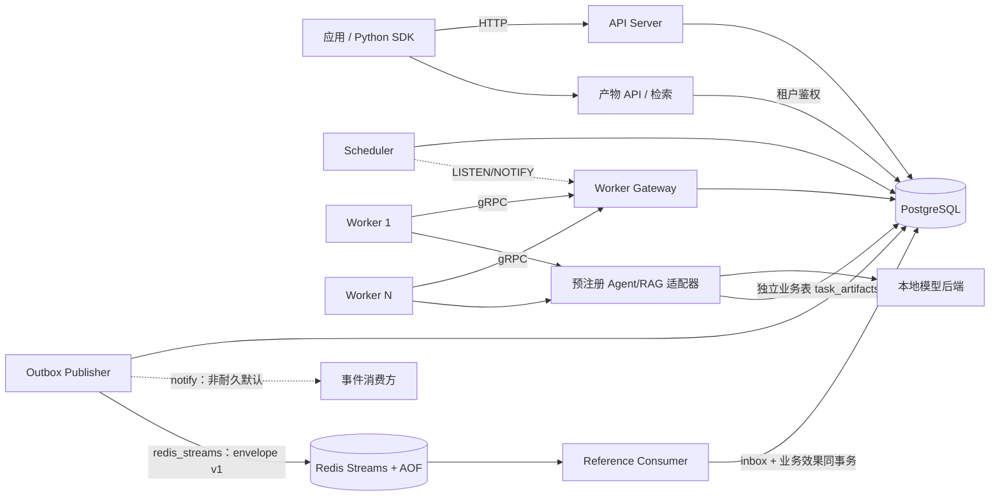

# JobForge

[](LICENSE)
[](https://go.dev)
[](https://www.postgresql.org)

**一句话定位：JobForge 是一个面向 Agent、RAG 与通用后台任务的分布式任务编排平台——以 PostgreSQL 为唯一事实源，提供可恢复、可观测、可隔离的 at-least-once 可靠执行底座。**

下一阶段[Agent v3路线](docs/plans/agent-execution-roadmap-v3.md)以云端主chat构建可恢复业务Agent，本地chat为可选扩展。S0、S1-A及[Run控制与调用账本](docs/agent-v3-runs.md)均已合并，正式DeepSeek执行器与云端业务验收尚未完成。下面的架构和快速开始对应现有v0.6服务。

## 系统架构



- **API / Scheduler / Gateway / Publisher / Artifacts / Consumer**：同一 Go 二进制的不同子命令，按需独立部署；`consumer` 是可选参考实现，`artifacts` 提供租户隔离的产物查询与索引检索。
- **Worker**：独立进程，通过 gRPC 会话接入；核心 Runtime 只依赖 Gateway，预注册的业务适配器另用独立连接池持久化产物。模型调用、索引和抽取规则位于业务层。
- **PostgreSQL**：唯一强依赖外部服务，任务状态、租约、attempt 与事件 outbox 均在数据库事务中保持一致。

## 核心技术亮点

- **单事务原子 Claim**：`FOR UPDATE SKIP LOCKED` 领取，一个事务内原子更新 owner、lease、attempt、fencing token 与 state，并发下零重复领取。
- **Fencing Token 防陈旧写入**：Heartbeat / Complete / Fail 均校验 owner 与 fencing token，崩溃后"复活"的旧 Worker 写入一律返回 `STALE_LEASE`，绝不覆盖新状态。
- **5 秒级取消信号 SLO**：Gateway 默认向未显式覆盖的 Worker 下发 5s heartbeat 建议值；每次续租在 PostgreSQL 同一时钟采样中同时检测 cancelling，DB-clock `cancel_requested_at`→CANCEL signal p95 门禁为 ≤6s。Heartbeat 始终是可靠兜底，取消竞争、lease 与 fencing 语义不变（ADR-0008）。
- **崩溃自愈**：租约过期由 Scheduler 自动回收重投；Scheduler 自身通过 PostgreSQL advisory lock 单活，leader 故障秒级切换。
- **真实 Agent/RAG 与持久业务幂等**：`rag.index` 实际向量化并验证检索，`agent.extract` 调用固定模型抽取并校验 Schema；产物按 tenant/type/business_key 唯一发布。同 job 重投与人工 retry 克隆复用已发布产物，覆盖发布后、Complete 前真实进程崩溃；模型计算仍可能重复（ADR-0011）。
- **部署级任务类型目录**：API 与 Gateway 共用 `JOBFORGE_TASK_TYPES` 静态 allowlist；未知 type 在 job/outbox 入库前返回 `INVALID_ARGUMENT`，合法性不依赖 Worker 当前是否在线（ADR-0010）。
- **Worker 执行资格硬约束**：Register 只能声明目录内类型；Poll 的 queue/type 必须是已登记子集，登记能力、当前 `running+cancelling` 与 Claim 在同一事务核对，并发 Poll 不会突破 Worker capacity。
- **稳定 Worker 错误契约**：所有 Worker RPC 失败附带兼容新增的 `DomainErrorDetail{code,retryable}`；Runtime 优先按稳定领域码决定重试，旧 Gateway 仍按标准 gRPC status 回退。`CANCEL_REQUESTED` 映射为 `FAILED_PRECONDITION`。
- **Outbox 可靠事件**：任务终态与事件写入同一事务，Outbox Publisher 以 at-least-once 语义对外发布，发布故障不影响任务状态；外部 transport 可选 `redis_streams` 耐久交付（envelope v1 + Redis Streams，默认 `notify` 兼容非耐久，ADR-0006）。
- **事务性事件消费**：参考 Consumer 将 inbox schema 显式绑定到单一逻辑 group，使用 `consumer_inbox` 与业务效果同事务提交，提交后才 ACK；`XAUTOCLAIM` 恢复 pending，永久坏事件有界重试后进入不含 payload 的 poison stream。group/事件元数据冲突或已被裁剪的 pending payload 会 fail closed，不会静默 ACK。该协议只去重 PostgreSQL 同事务效果，不承诺端到端 exactly-once。
- **租户隔离与背压**：租户级 inflight 硬配额由派生计数表在 Claim 事务内原子预留（running+cancelling 口径，并发下零超配，满额租户不阻塞他人，ADR-0007）+ 队列深度背压，单租户打满不影响他人。
- **全链路可观测**：可选 OTLP → Collector → Jaeger 贯穿 Python SDK、API、Gateway、Worker、业务模型与上报；Grafana 展示积压、执行结果、耗时、重试/DLQ、Worker 存活和租约恢复。遥测故障不改变任务状态。
- **故障与契约证据**：AT-01～AT-24、AT-28～31 已实现范围以真实 PostgreSQL/Redis + `go test -race` 验证；AT-02 会实际 Kill/Wait Worker 子进程，AT-13 在 scale 套件执行 100 轮真实进程终止。AT-25 ControlStream 仍是未实现的可裁剪 P1。
- **通用任务验收**：AT-32～42 覆盖真实 HTTP/Python 契约、结果事务与隔离、两类模型任务各六种生命周期、实际 Trace 查询和 Compose 运维故障；本轮运行结果与限制见[实施记录](docs/agent-rag-progress.md)。
- **只运行预注册 Handler**：无任意代码执行入口，安全边界清晰。

## 量化证据

| 指标 | 数值 | 说明 |
|---|---|---|
| Submit 吞吐 | **307.94 jobs/sec** | v0.5 收官，100 jobs × 4 workers；相对实施前 +2.1% |
| Process 吞吐 | **395.09 jobs/sec** | v0.5 收官，100 jobs × 4 workers；相对实施前 +17.5% |
| 控制面延迟 p50 / p95 / p99 | **8.84 / 14.44 / 31.65 ms** | v0.5 同参数 e2e；p95 相对实施前改善 4.6% |
| Claim 微基准 | **7.071 ms/op** | v0.5 清洁 schema 后五轮中位数；相对实施前 7.695ms 改善 8.1%；历史 W4 绝对门禁仍单列未通过 |
| Gateway Poll 微基准 | **7.179 clean / 7.200 dirty ms/op** | 0019 后独立五轮中位数；20k dirty 仅比 clean +0.3%，较修复前 dirty 改善 26.7% |
| 20,000-job Claim p50 / p95 | **93.69 / 106.36 ms** | 0019 定向 scale；相对 v0.5 的 96.35/107.93ms 均改善 |
| 任务崩溃恢复 | **≤ 33 s** | lease TTL 30s + 扫描周期 + 余量，集成测试验证 |
| Scheduler 故障接管 | **≤ 12 s** | advisory lock 切换，双实例故障测试验证 |
| Heartbeat 取消信号 p95 | **4.281 s（20 样本）** | 默认 5s、随机相位、PostgreSQL DB-clock；门禁 ≤6s，见[可靠性报告](docs/reliability-report.md) |
| Goroutine 稳态 | 差异 **0**（容差 ±5） | 万级任务后无泄漏 |
| 故障与契约场景 | **AT-01～24、AT-28～31 已实现范围全通过** | 真实 PostgreSQL/Redis + race；AT-25 未实现且不计通过 |
| 规模化可靠性（AT-13/14） | **100 轮真实 Worker 进程 kill 零丢失 / 10,000 持久效果重投零重复** | `-tags scale` 套件，见[可靠性报告](docs/reliability-report.md) |
| v0.5 性能回归门禁 | 同环境 Claim / 20k Claim / e2e 恶化 **<15%** | 当前门禁通过；0019 已修复脏库 Gateway 扫描，历史 W4 绝对失败仍单列披露 |

完整数据与复现命令见[性能基线报告](docs/benchmark.md)。从旧版本升级时请先阅读 [5s Heartbeat 发布与滚动升级说明](docs/runbooks/heartbeat-5s-rollout.md)。

## 快速开始

```powershell
# 启动服务和免费的本地 CPU 模型后端
 docker compose -f deploy/compose.yaml --profile models up -d --build
 docker compose -f deploy/compose.yaml --profile models exec ollama ollama pull all-minilm:22m
 docker compose -f deploy/compose.yaml --profile models exec ollama ollama pull qwen2.5:0.5b
 python -m venv .venv
 .venv/Scripts/python.exe -m pip install './sdk/python[demo]'
 .venv/Scripts/python.exe examples/agent_rag.py
```

默认端口：HTTP API `:8080` · gRPC Gateway `:9090` · `/metrics` + pprof `:6060`（进程默认仅绑定 localhost，生产环境不应暴露）。

脚本会检查真实索引、检索命中和采购单抽取字段，并输出受租户鉴权保护的产物引用。首次模型下载/加载需要额外时间；Linux 使用 `.venv/bin/python`。启动、资源上限和清理见[真实任务指南](docs/real-tasks.md)，三分钟完整演示见 [demo-script.md](docs/demo-script.md)，当前验证状态见[实施记录](docs/agent-rag-progress.md)。

耐久发布与参考消费闭环可选启动：

```sh
JOBFORGE_OUTBOX_TRANSPORT=redis_streams \
docker compose -f deploy/compose.yaml --profile durable-events up -d --build
```

该 profile 增加 Redis AOF 与 `jobforge consumer`；默认 `docker compose up` 仍不依赖 Redis。生产从 `notify` 切换前必须执行[事件 transport 切换运行手册](docs/runbooks/event-transport-switch.md)。

## 文档导航

| 文档 | 用途 |
|---|---|
| [产品需求文档](docs/product/JobForge_PRD_v0.6.md) | 通用接入、真实 Agent/RAG 与可观测闭环 |
| [系统架构](docs/architecture.md) | 组件职责、数据流、状态机、部署拓扑 |
| [故障语义](docs/failure-semantics.md) | 故障模型、故障矩阵与恢复路径 |
| [可观测性](docs/observability.md) | Trace、Metrics、pprof 使用指南 |
| [下一阶段路线 v3](docs/plans/agent-execution-roadmap-v3.md) | 可恢复业务 Agent；S0/S1-A/B/C1/C2与C3契约已合并，C3a补普通观察ACK，正式进程及S2～S5待实现 |
| [Agent v3 Run开发](docs/agent-v3-runs.md) | Run API/SDK、内部Worker协议、调用预算、分层测试与启动 |
| [Agent v3 实施记录](docs/agent-v3-progress.md) | 新 PRD/ADR、试验证据与分阶段验收状态 |
| [路线 v2 对照](docs/plans/agent-execution-roadmap-v2.md) | 有界工具调用与公平评测；保留此前候选方案 |
| [性能基线](docs/benchmark.md) | 冻结基线、发布数据与复现命令 |
| [可靠性报告](docs/reliability-report.md) | scale 套件（AT-13/AT-14）运行结果与复现命令 |
| [开发环境](docs/development.md) | 本地构建、测试与检查命令 |
| [ADR 索引](docs/adr/README.md) | 架构决策记录 |
| [贡献指南](CONTRIBUTING.md) | 分支、提交与评审要求 |
| [安全策略](SECURITY.md) | 漏洞报告方式 |

## 协作方式

- 采用 **GitHub Flow** 分支模型与 **Conventional Commits** 提交规范，详见 [CONTRIBUTING.md](CONTRIBUTING.md)。
- 修改前请先阅读相关 PRD 与 ADR；改变可靠性语义、公开接口或关键技术边界时，须先提交 ADR 并同步更新文档与测试。
- 数据库变更只允许新增 versioned migration，不改写历史。
- 安全漏洞请勿公开 issue，按 [SECURITY.md](SECURITY.md) 私密报告。

## 许可证

本项目基于 [Apache License 2.0](LICENSE) 开源——与 Go、gRPC、OpenTelemetry、Prometheus 等核心依赖生态一致，并提供明示的专利授权，便于二次使用。
