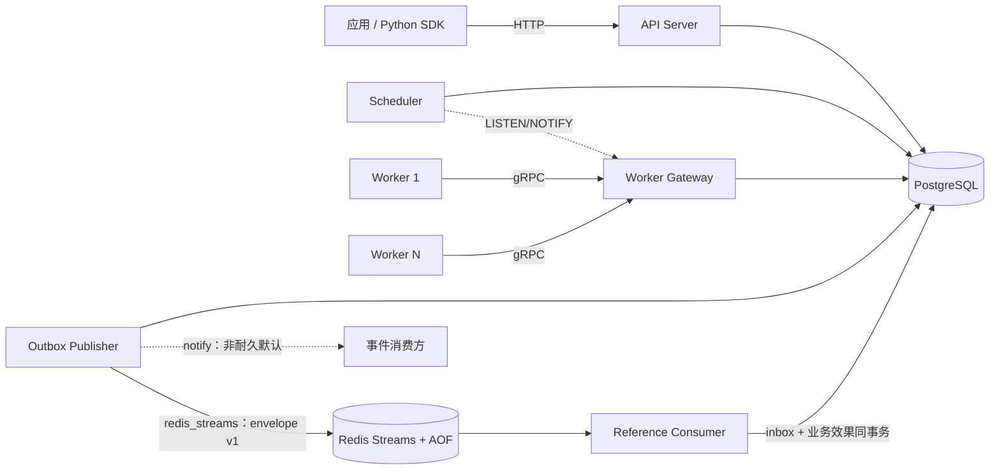

# JobForge

[](LICENSE)
[](https://go.dev)
[](https://www.postgresql.org)

**一句话定位：JobForge 是一个面向 Agent、RAG 与通用后台任务的分布式任务编排平台——以 PostgreSQL 为唯一事实源，提供可恢复、可观测、可隔离的 at-least-once 可靠执行底座。**

## 系统架构



- **API / Scheduler / Gateway / Publisher / Consumer**：同一 Go 二进制的不同子命令，按需独立部署、水平扩展；`consumer` 是可选参考实现。
- **Worker**：独立进程，通过 gRPC 会话接入，可任意扩缩。
- **PostgreSQL**：唯一强依赖外部服务，任务状态、租约、attempt 与事件 outbox 均在数据库事务中保持一致。

## 核心技术亮点

- **单事务原子 Claim**：`FOR UPDATE SKIP LOCKED` 领取，一个事务内原子更新 owner、lease、attempt、fencing token 与 state，并发下零重复领取。
- **Fencing Token 防陈旧写入**：Heartbeat / Complete / Fail 均校验 owner 与 fencing token，崩溃后"复活"的旧 Worker 写入一律返回 `STALE_LEASE`，绝不覆盖新状态。
- **崩溃自愈**：租约过期由 Scheduler 自动回收重投；Scheduler 自身通过 PostgreSQL advisory lock 单活，leader 故障秒级切换。
- **Outbox 可靠事件**：任务终态与事件写入同一事务，Outbox Publisher 以 at-least-once 语义对外发布，发布故障不影响任务状态；外部 transport 可选 `redis_streams` 耐久交付（envelope v1 + Redis Streams，默认 `notify` 兼容非耐久，ADR-0006）。
- **事务性事件消费**：参考 Consumer 将 inbox schema 显式绑定到单一逻辑 group，使用 `consumer_inbox` 与业务效果同事务提交，提交后才 ACK；`XAUTOCLAIM` 恢复 pending，永久坏事件有界重试后进入不含 payload 的 poison stream。group/事件元数据冲突或已被裁剪的 pending payload 会 fail closed，不会静默 ACK。该协议只去重 PostgreSQL 同事务效果，不承诺端到端 exactly-once。
- **租户隔离与背压**：租户级 inflight 硬配额由派生计数表在 Claim 事务内原子预留（running+cancelling 口径，并发下零超配，满额租户不阻塞他人，ADR-0007）+ 队列深度背压，单租户打满不影响他人。
- **全链路可观测**：OpenTelemetry Trace 贯穿 API → Gateway → Worker；10 个 Prometheus 核心指标；pprof 在线诊断。
- **故障注入全覆盖**：AT-01～AT-12 故障场景（并发领取、ACK 前崩溃、陈旧写入、心跳丢失、调度切换等）全部以真实 PostgreSQL + `go test -race` 验证。
- **只运行预注册 Handler**：无任意代码执行入口，安全边界清晰。

## 量化证据

| 指标 | 数值 | 说明 |
|---|---|---|
| Submit 吞吐 | **364 jobs/sec** | 端到端基准，W7 发布数据 |
| Process 吞吐 | **429 jobs/sec** | 100 jobs × 4 workers |
| 控制面延迟 p50 / p95 / p99 | **8.4 / 12.9 / 25.5 ms** | 提交到领取全链路 |
| Claim 微基准 | ~3.55 ms/op | 含租户配额检查与 fencing 更新 |
| 任务崩溃恢复 | **≤ 33 s** | lease TTL 30s + 扫描周期 + 余量，集成测试验证 |
| Scheduler 故障接管 | **≤ 12 s** | advisory lock 切换，双实例故障测试验证 |
| Goroutine 稳态 | 差异 **0**（容差 ±5） | 万级任务后无泄漏 |
| 故障注入场景 | **AT-01 ～ AT-12 全通过** | 真实 PostgreSQL + race 检测 |
| 规模化可靠性（AT-13/14） | **100 轮 Worker kill 零丢失 / 万级重复投递零副作用** | `-tags scale` 套件，见[可靠性报告](docs/reliability-report.md) |
| 性能回归门禁 | 吞吐 -15% / p95 -20% 即失败 | 基线已冻结，持续守护 |

完整数据与复现命令见[性能基线报告](docs/benchmark.md)。

## 快速开始

```sh
# 一条命令启动全栈：PostgreSQL + API + Scheduler + Gateway + Outbox Publisher + 2 Worker
docker compose -f deploy/compose.yaml up -d --build

# 提交第一个任务
curl -s -X POST http://localhost:8080/v1/jobs \
  -H "Content-Type: application/json" \
  -H "X-API-Key: dev-api-key" \
  -d '{"queue":"default","type":"demo.echo","payload":{"message":"hello"}}'

# 查询任务状态
curl -s http://localhost:8080/v1/jobs/{job_id} -H "X-API-Key: dev-api-key"
```

默认端口：HTTP API `:8080` · gRPC Gateway `:9090` · `/metrics` + pprof `:6060`（进程默认仅绑定 localhost，生产环境不应暴露）。

三分钟完整演示见 [demo-script.md](docs/demo-script.md)。

耐久发布与参考消费闭环可选启动：

```sh
JOBFORGE_OUTBOX_TRANSPORT=redis_streams \
docker compose -f deploy/compose.yaml --profile durable-events up -d --build
```

该 profile 增加 Redis AOF 与 `jobforge consumer`；默认 `docker compose up` 仍不依赖 Redis。生产从 `notify` 切换前必须执行[事件 transport 切换运行手册](docs/runbooks/event-transport-switch.md)。

## 文档导航

| 文档 | 用途 |
|---|---|
| [产品需求文档](docs/product/JobForge_PRD_v0.1.md) | 产品边界、状态机、接口与验收标准 |
| [系统架构](docs/architecture.md) | 组件职责、数据流、状态机、部署拓扑 |
| [故障语义](docs/failure-semantics.md) | 故障模型、故障矩阵与恢复路径 |
| [可观测性](docs/observability.md) | Trace、Metrics、pprof 使用指南 |
| [性能基线](docs/benchmark.md) | 冻结基线、发布数据与复现命令 |
| [可靠性报告](docs/reliability-report.md) | scale 套件（AT-13/AT-14）运行结果与复现命令 |
| [开发环境](docs/development.md) | 本地构建、测试与检查命令 |
| [ADR 索引](docs/adr/README.md) | 架构决策记录 |
| [贡献指南](CONTRIBUTING.md) | 分支、提交与评审要求 |
| [安全策略](SECURITY.md) | 漏洞报告方式 |

## 协作方式

- 采用 **GitHub Flow** 分支模型与 **Conventional Commits** 提交规范，详见 [CONTRIBUTING.md](CONTRIBUTING.md)。
- 修改前请先阅读相关 PRD 与 ADR；改变可靠性语义、公开接口或关键技术边界时，须先提交 ADR 并同步更新文档与测试。
- 数据库变更只允许新增 versioned migration，不改写历史。
- 安全漏洞请勿公开 issue，按 [SECURITY.md](SECURITY.md) 私密报告。

## 许可证

本项目基于 [Apache License 2.0](LICENSE) 开源——与 Go、gRPC、OpenTelemetry、Prometheus 等核心依赖生态一致，并提供明示的专利授权，便于二次使用。
