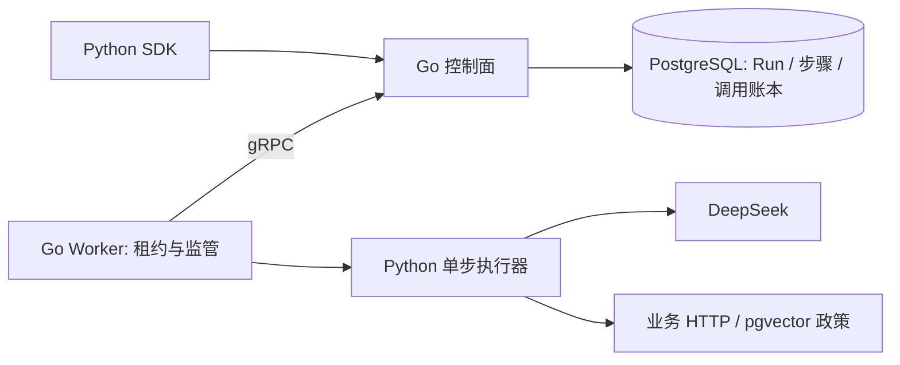

# JobForge

**一个可恢复、受预算约束、可审计的售后 Agent 服务。**

输入合成售后工单，Agent 按需查询订单、物流和政策，生成带来源的处理方案。Go 控制执行权、持久步骤和调用预算，Python 执行预注册的模型与只读工具步骤，PostgreSQL 保存事实。

当前阶段交付到**可审阅方案**：`awaiting_approval` 不代表已审批、已写入业务系统或已解决工单。历史 S2 开发集结果为 **37/40，安全硬失败 0**；见[原始验收报告](docs/evidence/agent-v3-s2-delivery-2026-09-17.md)。本次验证与限制另见[阶段交付记录](docs/evidence/reviewable-agent-release.md)。

## 先运行什么

无需模型密钥的开发检查：

```sh
python3 -m venv .venv
.venv/bin/python -m pip install -r tools/requirements-lint.txt
.venv/bin/python -m pip install --no-deps -e ./sdk/python -e ./python
.venv/bin/python -m pytest -q sdk/python/tests python/tests tools/support_evaluation
```

这些检查验证 SDK、Agent 决策/来源约束和评测器，不证明真实模型质量。Go、数据库与受监管执行器的完整分层命令见[验证指南](docs/verification.md)。Windows 将 `.venv/bin/python` 换成 `.venv/Scripts/python.exe`；正式执行器使用 Linux 容器。

需要真实模型演示时，按[云端运行指南](docs/agent-v3-cloud-batch.md)部署独立业务库与控制库，使用[S2 配置和 SDK 示例](docs/agent-v3-support-agent.md)。默认不启用收费 profile；先冻结当前模型身份、费率和有限预算，再启动一案。旧的价格快照和历史预算不能直接复用。

## 为什么这样实现


```mermaid
flowchart LR
    SDK[Python SDK] --> Control[Go 控制面]
    Control --> PG[(PostgreSQL: Run / 步骤 / 调用账本)]
    Worker[Go Worker: 租约与监管] -->|gRPC| Control
    Worker --> Python[Python 单步执行器]
    Python --> Model[DeepSeek]
    Python --> Business[业务 HTTP / pgvector 政策]
```

- **恢复有依据**：复用已提交步骤；未提交工作可能重做，陈旧 fencing token 不能提交。
- **模型权限有限**：模型选择只读工具或提交方案；Go 校验参数、来源和额度。
- **费用可追踪**：逐物理调用记录授权、报告、observed usage、known cost 与 held cost；响应不完整时保留上界并停发。
- **故障可验证**：真实 PostgreSQL、gRPC、Linux 子进程与 race 测试覆盖确认丢失、陈旧写入、取消和清理。

这是有限业务场景的执行服务，不是通用 Agent 框架。审批写入、恢复成本对比和保留集质量验收尚未完成。旧 Jobs、RAG 产物、多租户和事件能力仍保留为可测试的兼容层，见[Jobs 指南](docs/jobs-guide.md)。

## 从这里继续

| 目的 | 入口 |
|---|---|
| 理解 Run、步骤、预算和安全边界 | [核心概念](docs/concepts.md) |
| 判断当前方向和哪些尚未交付 | [当前产品范围](docs/product/README.md) |
| 开发、验证、定位失败 | [验证指南](docs/verification.md)、[开发环境](docs/development.md) |
| 找协议、运维、历史依据 | [文档索引](docs/README.md) |
| 贡献代码 / 使用编码 Agent | [贡献指南](CONTRIBUTING.md)、[AGENTS.md](AGENTS.md) |

许可证：[Apache-2.0](LICENSE)。安全问题按[安全策略](SECURITY.md)报告。
