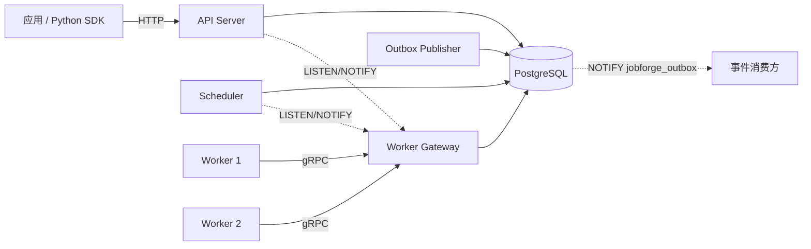
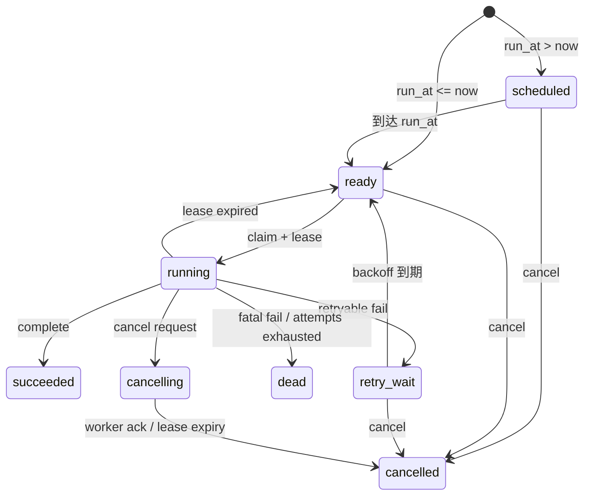

# JobForge 系统架构

本文档描述 JobForge 分布式任务编排平台的系统架构。产品边界与验收语义见 [PRD](product/JobForge_PRD_v0.1.md)，架构决策见 [ADR 目录](adr/README.md)。

## 架构概览



**核心约束**：

- 交付语义为 **at-least-once**，不承诺 exactly-once；外部副作用由业务幂等保护。
- PostgreSQL 是 P0 唯一事实源；任务状态、租约和 attempt 在数据库事务中保持一致。
- 只运行预注册 Handler，不允许上传或执行任意代码。

## 组件职责

| 组件 | 职责 | 不负责 |
|---|---|---|
| API Server | 提交、查询、取消、人工重试；API key 鉴权；参数校验；队列背压 | 执行业务任务 |
| Scheduler | scheduled/retry_wait → ready 推进；过期 lease 回收；advisory lock + 领导权租约（epoch fencing，ADR-0005）单活 | 存储业务结果 |
| Worker Gateway | gRPC Worker 会话管理；Poll/Heartbeat/Complete/Fail 事务；fencing 验证 | 运行用户 Handler |
| Worker Runtime | 并发池执行；Handler 注册；context/deadline 传播；心跳维持；优雅退出 | 决定任务最终状态 |
| PostgreSQL | 任务状态、租约、attempt、Worker、outbox 的唯一事实源 | 执行任意业务代码 |
| Outbox Publisher | 轮询发布 outbox_events（at-least-once，LISTEN/NOTIFY）；进度追踪与 retention 清理 | 改写任务核心状态 |
| 运维 CLI（jobforge ctl） | 纯客户端查询与 DLQ 人工恢复（list/get/cancel/retry）；outbox 只读积压视图 | 引入服务端特权路径 |
| Observability | OTel tracing；Prometheus metrics；pprof 诊断 | 业务逻辑 |

## 数据流

### 任务提交与执行

```text
1. Client → POST /v1/jobs → API Server
2. API Server → INSERT jobs (state=ready/scheduled) → PostgreSQL
3. API Server → NOTIFY jobforge_events → PostgreSQL
4. Scheduler → 扫描 scheduled/retry_wait 到期 → UPDATE state=ready
5. Worker → Poll RPC → Gateway → SELECT FOR UPDATE SKIP LOCKED → PostgreSQL
6. Gateway → 返回 ClaimedJob (lease + fencing token) → Worker
7. Worker → 执行 Handler → 外部副作用
8. Worker → Heartbeat RPC (周期性) → Gateway → UPDATE lease_until
9. Worker → Complete/Fail RPC → Gateway → UPDATE state + INSERT job_attempts
```

### 提交幂等与冲突检测

带 `idempotency_key` 的提交在 `(tenant_id, idempotency_key)` 部分唯一索引上去重；`jobs.request_hash`（migration 0008）存储提交请求的规范化 sha256，覆盖 queue、type、payload（JSON 规范化：键排序、去空白）、priority、run_at、max_attempts、timeout_seconds：

| 冲突场景 | 行为 |
|---|---|
| 同键同参数（哈希一致） | 202 + `deduplicated=true`，返回**已有** job_id 与当前状态（PRD FR-001） |
| 同键异参（哈希不一致） | 409 + `CONFLICT`，错误消息携带已有 job id（ADR-0002） |
| 存量行 request_hash 为 NULL（migration 0008 前创建） | 保持旧语义：直接去重返回已有任务 |

规范化要点：省略 `run_at` 时哈希使用哨兵值而非服务端 `now()` 填充值，否则合法重试会被误判冲突；省略 `max_attempts`/`timeout_seconds` 与显式传默认值哈希一致。payload 规范化保留数字原文（`json.Number`，不经过 float64），>2^53 大整数不损精度、不同大整数不会碰撞同哈希；已知权衡：`1e2` 与 `100` 等数值等价但文本不同的表示哈希不同（保真优先，避免异参提交被静默去重）。

### Outbox 事件发布与耐久事件通道（PRD v0.2 / v0.3 §5.1，ADR-0003 / ADR-0006）

**通道分层（FR-701）**：内部任务唤醒 hint（`jobforge_job_ready` LISTEN/NOTIFY + 轮询兜底）与外部事件通道分离；外部 outbox transport 为独立可配置适配器（`JOBFORGE_OUTBOX_TRANSPORT`，取值 `notify` | `redis_streams`，默认 `notify`）。同一时刻只启用一个外部 transport；notify 是 v0.2 兼容/本地开发默认，**非耐久**（启动日志与有界频率警告明确标记 `durable=false`），不得宣称其可重放（FR-705、D2）。

```text
1. 任务终态事务 → INSERT outbox_events (published_at NULL，含 envelope v1
   捕获列 aggregate_version/traceparent，migration 0016) → PostgreSQL
2. Publisher → 原子领取：UPDATE outbox_events SET claimed_at = now()
   WHERE ... published_at IS NULL ... FOR UPDATE SKIP LOCKED ... RETURNING
3. Publisher → 有界并发投递（Transport.Publish，每轮内不保证顺序）：
   - notify：pg_notify('jobforge_outbox', event_id) → 消费方收到 hint（非耐久）
   - redis_streams：XADD envelope v1 到固定 stream key（默认 jobforge:events），
     仅 XADD 成功响应算发布成功；Redis 不可用时保持未发布并退避，禁止降级
     NOTIFY 后标记成功（FR-702）
4. Publisher → 本轮成功事件一次性批量 UPDATE published_at = now()（单语句，
   独立短事务，不进入任务状态事务）
5. Cleaner → 周期清理 published_at 非空且超过保留期的行
```

领取为单语句原子操作（migration 0009 的 `claimed_at` 列），并发 publisher 不会领到同一事件；发布失败与优雅关停会即时释放领取，仅硬崩溃留下领取标记，已领取但超过 5 分钟未发布的行在下一轮自动重领。

**envelope v1（FR-703，PRD 附录 B）**：`schema_version`、`event_id`（业务去重键，不得用 Redis entry ID）、`aggregate_id`（partition key）、`aggregate_version`（jobs.state_version，检测重复/乱序）、`event_type`、`occurred_at`、`payload`、`traceparent`；捕获列在事件写入时随状态事务持久化，发布时无需回查 jobs。未来仅允许向后兼容新增字段。

**Redis Streams 形态（FR-704，ADR-0006 §2）**：consumer group 独立维护游标与 Pending Entries；数据耐久性依赖启用 AOF（`appendonly yes`、`appendfsync everysec`）与命名 volume（`deploy/compose.yaml` 的 `durable-events` profile）。Redis 只是事件交付依赖，不是任务状态事实源：broker 故障不回写 jobs，健康检查不将 Redis 纳入任务 readiness。

**notify → redis_streams 切换**是受控运维变更（非零停机，ADR-0006 §6）：暂停 publisher/retention → 记录 event_id 高水位 → 书面决定回灌/截断 → 启用并验证 Redis 后恢复；单一 `published_at` 无法证明交付目标，不得把切换前仅经 notify 标记成功的行宣称为已耐久交付。

发布语义为 at-least-once：消费方按 event_id 幂等去重；发布失败/publisher 崩溃不影响任务状态。

### 故障恢复流

```text
1. Worker 崩溃 → 心跳停止 → lease 过期
2. Scheduler → 扫描 running WHERE lease_until < now() → UPDATE state=ready
3. 新 Worker → Poll → 重新领取 (fencing_token 递增)
4. 旧 Worker 恢复 → Complete with old token → Gateway 返回 STALE_LEASE
```

## 状态机



**终态**：succeeded、dead、cancelled。终态不可逆转。

**并发规则**：

- Claim 事务使用 `FOR UPDATE SKIP LOCKED`，原子更新 lease_owner、lease_until、attempt、fencing_token、state。
- Heartbeat/Complete/Fail 必须匹配 job_id + lease_owner + fencing_token + 允许的当前状态。
- Complete 与 Cancel 竞争采用"事务先提交者生效"规则。

### 多队列领取语义

Worker 在 Register/Poll 中声明队列列表，Poll 对**全部**声明队列参与领取（`queue = any($queues)`）：

- **队列间**按声明顺序优先——先声明的队列先被领空，再轮到后续队列；
- **队列内**保持 `priority DESC, created_at ASC`；
- Poll/Register 对空队列列表（或含空串）返回 `INVALID_ARGUMENT`，不做静默忽略；
- `idx_jobs_claim` 部分索引逐队列命中，SKIP LOCKED 与单队列语义一致。

### 租户配额原子计数（PRD v0.3，ADR-0007）

租户 inflight 硬配额（`JOBFORGE_TENANT_MAX_INFLIGHT`，inflight = running + cancelling）由派生计数表 `tenant_quota_counters`（migration 0013）执行，jobs 仍是唯一事实源：

```text
1. 候选预筛：claimSelect 在行锁窗口前以 NOT EXISTS 排除 counter ≥ limit 的租户，
   其他租户候选回填窗口（满额租户不再饿死他人）
2. 快照定批：不加锁读取候选租户 counter 快照，按 limit − inflight 决定每租户领取数
   （快照只定批量大小，不保证硬上限）
3. 同事务领取 + 原子预留：先对计划候选执行 lease 更新 + attempt 写入，事务最后按
   tenant_id 升序逐租户批量条件 upsert（inflight + N ≤ limit，全局锁序：jobs 行 →
   counter 行）；条件不满足整批原子失败，回滚整个事务并以新快照重试（有界重试 3 次），
   回滚时领取与预留同时消失
4. 同事务释放：Complete / Fail（retry、dead、cancelling→cancelled）/ Scheduler lease 回收
   都在状态转换事务内扣减 counter；running→cancelling 不释放（FR-723）
5. 周期核对：Scheduler leader 每 JOBFORGE_QUOTA_RECONCILE_INTERVAL（默认 5m）比对
   counter 与 jobs 聚合，差异记入 jobforge_quota_counter_drift 并按 jobs 聚合修复；
   `jobforge ctl quota-reconcile [--repair]` 提供手工核对/修复
```

预筛读不加锁（READ COMMITTED 快照），陈旧只影响性能不影响正确性：硬上限始终由事务末尾的条件批量预留保证；预筛可由 `JOBFORGE_TENANT_QUOTA_PREFILTER=false` 关闭（正确性不降级）。快照显示满额而在定批阶段被跳过的候选数计入 `jobforge_quota_reservation_conflicts_total`。故障语义见 [failure-semantics.md](failure-semantics.md) “配额计数”节。

### 热路径部分索引

jobs 表的热路径查询均由部分索引服务，避免随表增长退化为全表扫描：

| 索引 | 定义 | 服务的查询 |
|---|---|---|
| `idx_jobs_claim` | `(queue, priority desc, created_at asc) WHERE state='ready'` | Claim 领取（0001） |
| `idx_jobs_lease_expiry` | `(lease_until) WHERE state IN ('running','cancelling')` | Scheduler 过期 lease 回收（0001） |
| `idx_jobs_promote_ready` | `(run_at) WHERE state IN ('scheduled','retry_wait')` | Scheduler promote 扫描（0011）：`run_at` 打头使扫描有序且命中 limit 即停，免排序 |
| `idx_jobs_tenant_inflight` | `(tenant_id) WHERE state IN ('running','cancelling')` | 配额核对聚合与采样断言（0014，ADR-0007）；取代 0012 的 `idx_jobs_tenant_running`（其消费者逐候选 count 被计数表替代，索引已在 0015 删除） |

## 部署拓扑

JobForge 使用单二进制多子命令模式，避免过早拆分微服务：

```text
┌─────────────────────────────────────────────────────────┐
│                    deploy/compose.yaml                    │
├─────────────────────────────────────────────────────────┤
│                                                          │
│  ┌──────────┐  ┌───────────┐  ┌─────────┐  ┌────────┐ │
│  │ postgres │  │    api    │  │scheduler│  │gateway │ │
│  │  :5432   │  │   :8080   │  │         │  │ :9090  │ │
│  └──────────┘  └───────────┘  └─────────┘  └────────┘ │
│                                                          │
│  ┌──────────┐  ┌──────────┐                             │
│  │ worker-1 │  │ worker-2 │   (独立进程，可水平扩展)     │
│  └──────────┘  └──────────┘                             │
│                                                          │
└─────────────────────────────────────────────────────────┘
```

- **API / Scheduler / Gateway / Publisher**：同一 Go 二进制的不同子命令（`jobforge api`、`jobforge scheduler`、`jobforge gateway`、`jobforge publisher`）；`jobforge ctl` 为纯客户端运维子命令，复用 HTTP API 与 API key 鉴权。
- **Worker**：独立进程，通过 gRPC 连接 Gateway，可启动多个实例。
- **PostgreSQL**：唯一强依赖外部服务。
- **观测**：pprof + /metrics 绑定 `127.0.0.1:6060`（PRD 11.4）；OTel stdout exporter 默认零外部依赖。

## 关键设计决策

| ADR | 决策 | 核心要点 |
|---|---|---|
| [ADR-0001](adr/0001-implementation-parameters.md) | 实现参数 | lease TTL 30s、heartbeat 10s、scan 1s；unary long-poll；人工重试克隆新 job_id |
| [ADR-0002](adr/0002-error-classification.md) | 错误分类 | 4 类错误（client/server/business/transient）→ HTTP/gRPC 映射 |
| [ADR-0003](adr/0003-event-notification.md) | 事件通知 | PostgreSQL LISTEN/NOTIFY fan-out；不引入外部 MQ |
| [ADR-0004](adr/0004-observability-stack.md) | 可观测性 | OTel SDK + stdout exporter；Prometheus /metrics；pprof localhost |

## 目录结构

```text
jobforge/
├── cmd/jobforge/           # 单二进制入口（api/scheduler/gateway/worker/publisher/ctl/migrate 子命令）
├── internal/
│   ├── api/http/           # HTTP 控制面 API（chi router）
│   ├── config/             # 环境变量配置
│   ├── ctl/                # 运维 CLI 客户端（HTTP API + outbox 只读查询）
│   ├── domain/             # 领域模型、状态机、错误定义
│   ├── gateway/grpc/       # gRPC Worker Gateway
│   ├── migrate/            # 自动迁移（embed SQL）
│   ├── notify/             # LISTEN/NOTIFY fan-out
│   ├── observability/      # OTel tracing + Prometheus metrics + pprof
│   ├── outbox/             # Outbox publisher（at-least-once 发布 + retention 清理）
│   ├── scheduler/          # 调度器（promote + recover 循环）
│   ├── store/postgres/     # PostgreSQL 存储层（pgx v5）
│   └── worker/             # Worker Runtime + demo handlers
├── proto/jobforge/worker/v1/  # gRPC proto 定义
├── sdk/python/             # Python SDK（httpx）
├── migrations/             # Versioned SQL migrations
├── tests/integration/      # 集成测试 + 故障注入测试
├── benchmarks/             # 微基准 + 端到端基准
├── deploy/                 # Docker Compose + Dockerfile
└── docs/                   # 文档（本文件、PRD、ADR、规范）
```

## 技术栈

| 层级 | 技术 |
|---|---|
| 语言 | Go 1.26 |
| HTTP | go-chi/chi v5 |
| gRPC | google.golang.org/grpc + protobuf |
| 数据库 | PostgreSQL 16 + jackc/pgx v5 |
| Proto 管理 | buf v2 |
| 可观测性 | OpenTelemetry SDK + Prometheus client_golang |
| Python SDK | httpx |
| 容器化 | Docker + Docker Compose |
| Lint | golangci-lint + ruff (Python) |

## 相关文档

- [故障语义与恢复](failure-semantics.md) — 故障模型、故障矩阵和恢复路径
- [可观测性体系](observability.md) — Trace、Metrics、pprof 使用说明
- [性能基线](benchmark.md) — W4 冻结基线 + 最终发布数据
- [演示脚本](demo-script.md) — 3 分钟可复现演示
- [开发环境](development.md) — 本地开发、测试和检查命令
