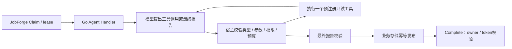

# 下一阶段路线 v2：有界 Agent 执行与真实业务评测

> 后续候选：[路线 v3](agent-execution-roadmap-v3.md) 按“不考虑历史包袱和兼容性”的新前提重新设计。本版保留用于比较，尚未实施。

- 日期：2026-09-16；状态：**候选路线，供维护者审阅，尚未进入实现**。
- 定位：面向 AI 应用后端校招的可靠 Agent 任务执行服务。
- 当前代码基线：5c82834；当前规划分支：XJfyrh/docs-ai-backend-next-stage-plan。
- 本路线替代[初版计划](ai-backend-next-stage.md)的实施排序与范围；初版保留用于对照。
- 当前有效契约仍为 [PRD v0.6](../product/JobForge_PRD_v0.6.md)、[ADR-0011](../adr/0011-general-task-results-and-model-adapters.md)、[ADR-0012](../adr/0012-task-observability-and-otlp.md)。本文件不将任何新能力标为已接受或已验收。

## 1. 本版请重点审阅的五项取舍

| 决策 | 推荐范围 |
|---|---|
| 主线业务 | 新增 agent.review_order：采购单核查；保留 rag.index 和 agent.extract，分别提供检索与抽取基础 |
| Agent 自主范围 | 模型在三个预注册只读工具中决定下一步；宿主程序校验参数、授权、预算及结束条件 |
| 执行架构 | 一个 Agent job、一个 Go Worker 租约；工具步骤不是子job，不增加工作流调度器 |
| 恢复承诺 | 未发布报告时从头重执行；报告已发布则复用。首轮不实现 checkpoint、人工暂停后续跑或确定性重放 |
| 外部依赖与工期 | 本地真实模型优先，远程服务和预算尚待选；粗估16～22个专注开发日，替代旧版12～17日估算 |

核心成果是一段可以实测和解释的链路：提交核查任务 → 模型选择查证动作 → 真实工具返回结果 → 模型继续或结束 → 校验并幂等发布报告 → 查询任务、产物及执行轨迹。

Anthropic将预先编码的流程与模型主导步骤选择的Agent区分，并强调环境反馈与停止条件。本路线采用一个明确业务中的受限循环；其收益由固定流程对照验证。[架构参考](https://www.anthropic.com/engineering/building-effective-agents)

## 2. 业务场景与三种任务的关系

演示场景使用合成采购单、冻结的供应商资料和采购政策。Agent核对金额、供应商状态、适用条款及例外，最终返回报告。它不批准付款，不发邮件，不修改供应商资料。

| 类型 | 角色 | 本阶段变化 |
|---|---|---|
| rag.index | 为版本化采购规则建立真实向量索引 | 保留旧样例兼容；增加业务规则语料与模型/向量空间身份，检索是Agent的一个工具 |
| agent.extract | 从采购文档生成结构化事实 | 保留抽取基线及一次有界修正；支持预注册文档，独立评估字段正确率 |
| agent.review_order（新增） | 根据已知事实选择查证步骤并形成核查报告 | 增加真正的多轮模型→工具→模型循环，成为主验收与演示任务 |

索引和抽取作为显式准备任务，由演示/评测客户端依次提交并等待结果，再提交核查任务。Agent Handler内部不等待嵌套job，不持有多个租约。准备失败的样本留在端到端报告中，不用人工修正的gold替换抽取结果。

核查输入只包含版本化document/extraction/index/profile引用、业务键和已授权验收批次。原始文档在预注册业务资源中，产物引用需重新校验tenant归属与版本；URI或模型给出的ID本身不构成授权。

## 3. 三个工具与执行循环

| 工具（候选名） | 功能 | 宿主程序的约束 |
|---|---|---|
| lookup_supplier | 在固定业务快照中查询供应商或候选记录 | 查询词长度、候选数与返回大小受限；数据集和tenant来自任务上下文 |
| retrieve_policy | 在该任务绑定的真实索引中检索采购条款 | 模型可生成有界query，不能选任意索引/URL；使用产物绑定的embedding profile |
| check_amounts | 以确定性十进制规则校验数量、价格与合计 | 从授权的文档/抽取/价格快照读取值，模型不能任意编造数字令校验通过；缺数据返回明确结果 |

示例分支包括：供应商名称模糊时查询候选；发现特殊类别后补查例外条款；金额不一致时读取校验结果；必要信息无法确定时形成需要人工复核的结论。不同案例是否走不同路径由真实模型运行展示，不在测试中伪造模型决策。

第一版使用原生tool-calling协议的薄适配，宿主只接受单次一个工具调用或一个最终报告。模型返回多个调用、未知工具、畸形参数、冲突的结束信号时，不执行其中任意一个，而是返回固定错误并消耗本轮预算。整个attempt最多一次专门协议纠正，额度用尽明确失败。

工具返回是数据，不是新的指令来源。文档中的“忽略规则”、工具返回中的提示词和伪造租户ID均不能注册能力、改变权限或扩大预算。权限拒绝、未知引用和跨租户访问通过程序强制执行。

## 4. 报告、停止条件与故障语义

报告候选Schema包含decision、findings、evidence_refs、checks_performed、unresolved_fields，以及模型/profile/规则/供应商快照版本。结论枚举建议：

- no_issue_found：必要核查已完成，未发现违反既定规则的证据。
- issues_found：发现明确问题，给出对应事实与条款。
- needs_review：必要业务事实缺失、来源冲突或无法消歧。

checks_performed由宿主按实际步骤填充，不能让模型声称完成未执行的检查。evidence_refs只接受授权的绑定产物或本次工具实际返回的证据。结构和引用校验通过不等于业务结论正确，结论质量由独立标注评测。

报告结构合法、引用获授权且发布成功时，三种结论都对应job=succeeded。needs_review是业务结果，不新增队列状态，也不表示已实现人工审批暂停与恢复。输出非法、依赖故障、预算耗尽不能一律改写为needs_review掩盖失败。

候选执行上限在R0正式冻结；以下为首轮保守配置，不修改旧两个任务的上限：

| 范围 | 建议上限 / 行为 |
|---|---|
| Agent模型决策 | 每attempt≤8次，含纠正和最终报告；每次最多请求一个工具 |
| 工具 | 每attempt≤6次派发尝试；错误参数/拒绝也消耗尝试额度，实际执行另计 |
| 嵌套模型请求 | retrieval引起的embedding也计数；当前三个工具无其他LLM子调用，核查attempt最多8次chat＋6次query embedding。实际HTTP请求另计元信息校验等开销，不能将推理次数当HTTP总数 |
| 时间 | 整个核查attempt≤180s且不超过job剩余deadline；单模型/工具操作≤60s且共享剩余时间 |
| 内容 | 每次模型输出设置候选1024 Token上限并按≤16 KiB校验；单工具结果≤8 KiB、累计工具内容≤32 KiB、最终报告≤16 KiB；完整产物仍≤2 MiB |
| 输入与上下文 | 固定profile规定模型上下文/输入Token上限和有界消息历史；超限明确失败，不能静默丢掉证据继续判断 |
| 实验批次 | 跨Worker、自动重投、人工retry与同步查询共享持久调用额度；金额预算B尚未确定 |

前置索引、抽取和额外评测查询不属于“14次核查推理请求”范围，必须另外计入整个验收批次。所有调用按类型计数；任何收费请求（含能力试验、普通开发集和故障验收）必须先确认预算B并原子预留批次额度，无响应或kill后保守消耗。usage缺失记unknown；金额估算依据精确模型/地域/价格版本，不能将请求数上限解释为供应商账单硬保证。

预算批次由服务端登记并绑定tenant；额度创建或增加属于管理员操作。批次缺失、伪造、跨租户及重试克隆不能绕过额度。调用审计表只记预留/用量，不存可领取工作、不拥有lease、不决定job状态。

| 情形 | 本版明确行为 |
|---|---|
| 查无供应商、条款无命中、金额不一致 | 有界业务工具结果，模型可继续查证或形成合适报告；不触发队列重试 |
| 工具参数错误 / 模型协议错误 | 不执行非法动作；最多一次专门纠正机会，仍计入8次模型和6次工具上限，再错按永久执行错误结束 |
| 网络/临时模型服务不可用 | 中止当前attempt，由现有队列退避重试；模型客户端及工具没有隐藏重试 |
| 鉴权/额度耗尽/不支持的模型 | 不可重试失败；修复配置后才人工retry，不循环消耗调用预算 |
| deadline / 取消 / 失租 | 停止后续步骤和发布尝试；deadline沿用既有TIMEOUT策略，取消/失租沿用Runtime与Gateway语义；已发出的远程计算可能继续 |
| 循环或内容预算耗尽 | 明确不可重试业务错误，不把未完成核查报告伪装成成功 |

重复完全相同的工具调用也计入额度；连续两次相同调用且没有新增信息时以循环停滞错误结束。正式错误码由R0统一定义并同步测试与文档。

## 5. 可靠性范围：复用队列，保持业务边界

Go Runtime继续作为唯一lease持有者。Agent循环的步骤不是子任务，也不另开异步模型作业。第一版顺序执行工具，避免并行动作、嵌套Agent和跨语言进程生命周期挤占主线。

业务幂等指纹覆盖：输入文档与抽取产物、规则索引、供应商/价格快照、模型profile、提示词/工具Schema、循环策略与报告Schema版本。同tenant/type/business_key同指纹只接受首份报告；人工retry克隆新job_id仍保留该业务键。新实验使用新run/strategy/case/repeat键，避免产物复用污染性能与质量结果。

恢复先验证tenant、引用/profile授权并查已发布报告；命中后直接复用，不因批次余额为0再次失败。只有派发新模型请求才检查余额并预留额度。这样最后一次额度生成报告后、Complete前kill仍可恢复；复用不能绕过访问控制。

| 崩溃或竞争窗口 | 恢复与证据 |
|---|---|
| 多轮工具执行后、报告发布前kill | 自然lease过期后重新执行；模型/只读工具可能重复调用，额度不回退 |
| 报告已发布、Complete前kill | 新attempt先查业务键并复用报告；不重复发布，也不重新进入Agent循环 |
| 旧Worker晚到 | Complete/Fail由owner/token fencing拒绝；核对原终态不被覆盖 |
| Cancel与业务发布竞争 | 已提交的报告可能保留；取消优先时Complete不得把引用写入jobs或改成succeeded |

当前业务Publish不检查jobs的owner/token，只检查context、唯一键和指纹。新版沿用这一事实，不能宣称队列fencing自动阻止所有陈旧Worker发布业务产物。若需要更强的跨存储发布fencing，必须另立设计，不隐藏在本轮“支持Agent”声明中。

步骤记录只包含attempt、序号、工具类型、耗时、固定结果类别、版本和用量，不记录模型私有推理、完整文档/输入输出或秘密。它用于Trace与诊断，不供重启续跑；crash可能丢遥测，不能用Trace承担账单或任务事实源。

## 6. 评测主线：固定条件流程与Agent的公平对照

主问题是：相同事实、工具能力和资源上限下，动态查证是否提高正确率或减少不必要调用。

| 数据 / 实验 | 范围 |
|---|---|
| 采购单核查 | 建议60份，40开发/20保留；三类结论尽量均衡，覆盖普通订单、供应商消歧、金额错误、政策例外/冲突、信息不足和干扰指令 |
| 抽取诊断 | 复用这60份原文，独立统计字段与整单正确率；不另铺一套无关联语料 |
| 检索诊断 | 建议30题，20开发/10保留；检索质量用于定位工具问题，不等同于Agent成功率 |
| 故障矩阵 | 独立于质量样本，覆盖取消、超时、工具故障、预算、非法调用与真实进程kill |

样本按模板族、案例改写和业务情景分组划分；政策/供应商快照冻结。人工核对gold结论、必要事实和支持证据；gold只由evaluator读取。开发阶段不运行保留集推理，冻结基线/Agent配置后再在同一保留集测量双方。测试集不参与工具描述或提示词调优。

needs_review案例应包含“采购单可成功抽取，但供应商或政策信息不足/冲突”的情形。缺少抽取Schema必填字段导致agent.extract失败时，记上游失败，不能称为Agent已正确输出needs_review；两者在结果行和分组报告中明确区分。

固定条件流程同样拥有三个工具、合理的条件分支、查询模板及一次有界消歧机会，最后由同一模型按同一Schema生成报告。它不必每次调用所有工具，也不能故意使用弱查询或少给证据。双方共享模型版本、工具数据、输入输出限制、次数/Token与deadline上限，实际使用量允许不同。

两种测量分别报告：

1. **决策对照**：两种策略读取同一份真实生成且冻结的抽取产物，记录其正确/错误/缺失情况；上游抽取失败单列，不手工替换gold。这样能把输入差异与工具循环收益分开。
2. **端到端展示**：SDK从原文提交抽取，再提交核查并查询最终产物；报告包含前置失败及所有成本。共享抽取产物的对照不能称为两次独立全链路推理。

| 主要指标 | 判定口径 |
|---|---|
| 核查结论准确率、三类macro-F1 | 准确率=正确数/manifest总数；macro-F1固定对三个业务标签求均值，执行失败/无结论计对应gold类FN。混淆矩阵另设execution_failed预测列，不新增第四业务类；可执行子集条件指标另列 |
| 错误放行率 | gold为issues_found/needs_review却输出no_issue_found；两类分别统计 |
| 必要证据覆盖、证据正确率 | 引用存在且支持结论；虚构条款/供应商/工具结果单列，不按工具调用越多给奖励 |
| 执行与安全 | 报告有效率、工具/协议错误、循环耗尽、预算耗尽；越权执行、突破额度、重复发布必须为0 |
| 资源代价 | 成功与失败样本的实际模型/工具次数、已知tokens、unknown用量、费用覆盖率及分段延迟 |

报告保留“不存在唯一正确工具顺序”的事实，以必要证据和结论评价。20个保留样本每个占5个百分点，附配对胜/平/负，不把小幅波动宣称为显著提升。

只选择一版开发集上确定的Agent策略进入保留集；先冻结质量/资源验收阈值再测量。Agent没有收益时记录负结果并保留固定流程优先结论，不能通过削弱基线或挑选样本制造提升。

## 7. 模型、资源与实现落点

本地优先但增加一个前置能力检查：最多筛选两个支持工具调用的本地候选，实测选择工具、参数、读回结果、结束及预算行为，再固定模型digest。当前qwen2.5:0.5b的抽取通过不代表Agent能力通过。Ollama平台提供tool-calling接口，但具体模型表现与本机内存/延迟须单独验证。[Ollama工具调用](https://docs.ollama.com/capabilities/tool-calling)

远程首选候选仍为百炼，模型必须重新核对tool-calling及输出限制，而不只看结构化抽取支持；供应商/地域/模型/费用B未定。备用自托管Ollama也需选择实际具备Agent能力的模型，不能仅将原0.5B模型搬到远端就宣称完成。[前期供应商调研](../research/ai-backend-evaluation-and-models-2026-09-16.md)

本地能力/资源不满足时，继续确定性协议、工具、基线与预算开发；实际Agent验收保持阻塞，待可用本地模型或已授权远程资源。不得用替身Agent记录代替真实决策。远程Agent成功、本地未通过时，两种环境状态分别报告。

首轮保持本地embedding即可支持Agent检索。远程chat/Agent接入优先于远程embedding；远程向量化移到可选扩展，不作为Agent主线依赖。旧索引始终绑定旧embedder，不能随chat模型切换一起更改向量空间。

| 落点 | 候选变化 |
|---|---|
| internal/tasks 业务包 | 预注册资源、不可变profile、三个工具、固定流程、Agent循环、报告与预算 |
| cmd/jobforge 与 internal/config | 构造业务依赖、注册新类型、验证queue/profile一致；具体文件按当前布局修改 |
| 业务表与migration | 必要的调用额度/元数据；仅新增versioned migration，不把Agent步骤塞进jobs |
| Python SDK/评测工具 | 复用submit/get/cancel/retry和产物API；有界顺序编排准备任务，不自建后台调度 |
| 观测与文档 | 新工具span/低基数计数、案例报告、三分钟演示、版本与限制说明 |

v1输入及原两任务验收保持。profile固定资源/模型/参数/工具/策略版本，重投不能采用新的全局默认配置；同一queue的Worker具备相同profile目录，异构能力用现有queue绑定隔离。模型不得指定URL、shell、代码、tenant或动态注册工具。

## 8. 阶段、依赖与交付

先审阅本路线，再进入R0的正式决策流程。粗估16～22个专注开发日，不含凭据开通/配额/下载等待；R0后校准，W4调查另限1～2日，可选项不计入主线估算。

| 阶段 / 建议独立PR | 估算 | 交付及退出条件 |
|---|---:|---|
| R0 契约与能力试验 | 1～2日 | PRD v0.7与必要ADR；明确v0.6“无动态工具选择”的限定变更；只做本地小样本能力/资源检查，结论可为可用或具体阻塞，不把阻塞记为模型通过 |
| R1 业务资源与固定流程 | 3～4日 | 版本化采购数据/工具/profile；合理固定流程；共享抽取输入、确定性工具与计分器可核对 |
| R2 有界Agent执行 | 4～5日 | 单job循环、结束/纠正/循环检测、报告校验；实际可用后端的多轮调用有证据，越权动作执行为0。实现可先评审，缺真实后端时本阶段验收未完成 |
| R3 调用治理与远程接入 | 3～4日 | 持久额度、unknown处理、队列错误分类；选定远程chat/Agent实际验收。凭据未定时先交付本地治理部分，远程保持待验收 |
| R4 公平对照与保留集 | 3～4日 | 开发集冻结策略；基线与Agent同一保留集报告；抽取/检索诊断和端到端成本分别列出 |
| R5 故障、观测与展示 | 2～3日 | 实际kill、自然租约恢复、发布幂等、取消/超时/人工retry；当前性能边界、Trace/Grafana和三分钟演示 |

R1准备与R0模型资源核对可部分并行。R2开始就实现本地次数/时间/内容限制；R3的持久批次额度必须在任何收费请求之前完成，包括能力试验和普通开发集。若本地模型不可用，R3最小额度与远程适配可前移至R1后、与R2协议实现并行；不要求先完成R2真实验收才能开始R3。R4有可用本地后端时先跑开发集，否则其真实评测保持阻塞；观测埋点与故障测试随各PR实现，不到R5才补。

R0的正式文档建议拆成业务执行契约与模型/profile/预算两个决策主题，是否合为一项ADR由评审决定，编号执行时检查。只有限定Handler内的预注册工具选择被提出放开；任意代码/工具发现/第二调度仍排除。当前Accepted ADR不在本次路线编辑中改写。

## 9. 必须通过的验收映射

下列ROUTE编号属于规划，不代表现有AT已经覆盖。

| ID | 场景 | 必须保留的证据 |
|---|---|---|
| ROUTE-01 | 注册agent.review_order、旧v1兼容、profile/租户隔离 | 真实HTTP/SDK、未知类型/引用/跨tenant拒绝、旧任务回归 |
| ROUTE-02 | 真实模型按工具反馈继续或结束 | 可核对的工具类别/步骤、真实业务结果、不同情景的有效路径 |
| ROUTE-03 | 未知/多工具/错参数/注入/重复动作 | 非法动作不执行；错误计数与有限纠正；循环按上限退出 |
| ROUTE-04 | token/字节/时间/请求额度 | 边界测试；跨Worker和人工retry不能突破批次额度；无响应保守消耗 |
| ROUTE-05 | 业务结论与任务状态 | needs_review报告成功时job=succeeded；依赖故障/预算耗尽不能伪装为业务结论 |
| ROUTE-06 | 暂时错误、永久错误、取消、超时、人工重试 | 工具结果与队列重试分工；既有状态/attempt审计、错误码和SDK查询 |
| ROUTE-07 | 发布前/后实际Worker Kill/Wait | 自然lease到期与新attempt；未发布重算、已发布复用；余额耗尽也不阻止授权产物复用；业务发布恰一次 |
| ROUTE-08 | 旧Worker写入及Cancel/Complete竞争 | STALE_LEASE与终态不变；披露独立业务发布竞争边界 |
| ROUTE-09 | 同输入固定流程/Agent比较 | manifest、gold隔离、全量失败行、共享输入、版本/预算与配对结果 |
| ROUTE-10 | Trace/Grafana及观测故障 | 每类重要成功/失败/恢复可关联；不记录敏感内容；后端故障不改变任务执行语义 |

依照 [AGENTS](../../AGENTS.md) 与 [CONTRIBUTING](../../CONTRIBUTING.md) 运行适用的格式、Go build/vet/lint/race、真实PG/Redis、SDK安装与HTTP契约、Python pytest/ruff/mypy、SQLFluff基线与migration lint、Buf lint/必要breaking、promtool与仪表盘一致性检查。新增业务类型/模型/配置路径应纳入真实模型CI触发和默认目录一致性检查。

Windows沿用 [验收手册](../runbooks/windows-acceptance.md)：集成测试前启动Compose postgres，设置JOBFORGE_TEST_DSN与安装后JOBFORGE_TEST_PYTHON，在可重建隔离环境执行时钟检查。真实模型与快速替身分层，scale仅按改动范围实际运行。收费工作流手动触发，凭据不提供给不可信PR。

真实供应商、故障代理＋真实模型、确定性替身三类证据分别标注。注入429/断流不等于供应商实际发生限流，也不证明HTTP取消后停止计算或退款。

## 10. 后置范围与完成声明

| 范围 | 本版安排 |
|---|---|
| Agent checkpoint、跨重启从某步骤续作 | 后置；步骤日志不构成恢复能力。必须有真实长流程需求后再设计业务快照、重放与副作用边界 |
| 人工审批暂停、并行工具、多Agent、子任务DAG、MCP动态发现 | 后置，避免扩大调度和授权范围 |
| 远程embedding及更多供应商 | 可选；首个chat/Agent后端和本地检索闭环完成后再评估 |
| W4历史性能门禁 | 继续明确失败；只做有界可比性/热点调查，新no-op或模型结果不能覆盖历史失败 |
| 生产留存/HA/PITR | 仍未验收；最小新库备份恢复为可选尾项，不能升级成全面生产承诺 |
| AT-25 ControlStream | 继续未实现与skip；当前Heartbeat取消语义不变 |

主线完成需要：真实Agent多步调用、任务与产物查询、全生命周期故障证据、公平评测、可复现安装与演示，以及适用工程门禁。报告同时列明本地和选定远程后端状态；远程未运行时只能宣布本地部分完成。模型没有超过固定流程也可完成诚实的实验，但不能写成效果提升。

本次交付限于路线v2、初版导航和研究补充。未实施工具、Agent循环、预算表或新模型验收。建议维护者先审阅第1节的业务场景、单job/只读边界、恢复承诺及工期，再进入R0。
