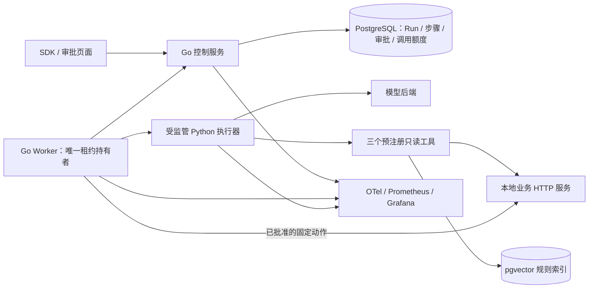

# 路线 v3：面向 AI 应用后端的可恢复业务 Agent

- 日期：2026-09-16；状态：**维护者已确认路线，S0 契约与关键试验进行中**；详见[实施记录](../agent-v3-progress.md)。
- 规划前提：按用户要求，不以历史实现、旧接口兼容和既有验收编号约束新版本设计。
- 目标：交付一个能查证、能等待人工批准、能执行受控动作、能从已完成步骤恢复的 Agent 服务。
- 对照版本：[路线 v2](agent-execution-roadmap-v2.md)。本版重新选择产品边界，不是给 v2 追加所有高级功能。

## 1. 建议先审阅的结论

**推荐做“订单交付异常处理 Agent”，以可靠完成一次业务处理为主线。** 用户提交售后工单，Agent 查询订单和物流、检索规则，提出有证据的方案；人工批准后，系统真实更新业务工单。

| 取舍 | 本版建议 | 预期价值 |
|---|---|---|
| 产品范围 | 一个完整业务场景，三个读工具、一个写动作、一个审批点 | 同一案例串联模型、工具、RAG、安全、恢复与结果 |
| Agent 能力 | 根据真实工具结果选择下一步，允许补查或明确结束 | 展示实际决策循环，而非给固定流程换名字 |
| 恢复能力 | 已提交的步骤结果复用；未完成步骤可重执行 | 可以测量崩溃后少重复了多少调用和工作 |
| 人工介入 | 批准具体方案后写入；等待时释放 Worker | 展示后端持久状态和权限边界 |
| 技术栈 | Go 执行控制面、Python 业务执行器、PostgreSQL/pgvector | 并发可靠性和 AI 业务开发分别有明确落点 |
| 展示方式 | SDK + 一个任务详情/审批页面 + Trace/Grafana | 面试时可操作、可查证，不依赖讲解截图 |
| 交付规模 | 约 24～32 个专注开发日，先形成中间闭环 | 不把跨语言、持久步骤和审批低估成小补丁 |

上述选择是针对作品集目标的工程判断，不代表某个招聘方的要求。最重要的证据是“实际完成什么、发生故障时怎样处理、效果和成本如何测量”。

## 2. 业务闭环：订单交付异常处理

采用固定合成工单、订单、物流事件和版本化售后政策。只覆盖延迟交付、签收争议、记录冲突和信息不足，避免扩成完整客服平台。

1. 用户通过 SDK 或页面提交工单引用和业务请求键。
2. Agent 读取授权工单，按需要查询订单、物流与政策；工具反馈可能促使它补查。
3. Agent 生成结构化方案：结论、证据引用、拟更新字段、未解决问题。
4. 系统校验方案，持久化待审批记录，释放租约和执行器资源。
5. 审阅者批准或拒绝具体方案。批准后任务重新领取，复核业务版本，再执行一次受控写入。
6. 用户查询业务工单、最终回执、步骤时间线、模型调用量和执行状态。

| 能力 | 实际工作 | 允许范围 |
|---|---|---|
| get_order | 通过业务 HTTP API 读取订单及版本 | 只能访问该租户和工单授权的订单 |
| get_delivery | 查询订单对应的物流事件 | 关联关系由服务端校验，不能任意枚举其他客户 |
| search_policy | 对冻结规则语料执行真实向量检索 | 限定租户、政策版本、top-k 和返回大小 |
| apply_ticket_resolution | 在业务服务中写入处理结论、内部说明与工单状态 | 仅执行已批准的精确内容，接收方事务去重 |

前三个工具由模型选择。第四项由执行控制面在审批通过后调用，模型不能直接获得写入能力。首轮只允许记录处理结论、标记待客户补充或升级人工跟进，不自动标记为 resolved。验收中的“业务动作完成”指批准内容已被正确写入，不等于物流恢复或客户问题已解决。

业务服务是独立进程，拥有真实 HTTP 接口和 PostgreSQL 业务表；它是可本地运行的演示业务系统，不是预录返回或测试替身。首轮不接支付、退款、邮件或真实客户系统。

不再要求 `rag.index`、`agent.extract` 作为两个独立产品任务保留。索引构建是预注册准备流程；结构化抽取按需要成为 Agent 的模型步骤。默认演示只围绕这一场景。

## 3. 重新选择架构

### 3.1 一种运行事实，明确进程责任

新版本对外统一称为 **Run**。它包含状态、attempt、当前步骤、租约、deadline 和结果引用；不并列维护“底层 job 调度器”和“Agent run 调度器”。步骤是 Run 的持久执行进度，没有自己的队列、租约或独立重试服务。

- **Go 控制服务**：API、鉴权、Run 状态转换、Claim/lease/fencing、步骤提交、审批、预算、恢复扫描和事件查询。初版可合并 HTTP、内部 Worker 协议和扫描器部署。
- **Go Worker**：持有唯一租约；按已提交游标调度下一个步骤；监管 Python 生命周期；提交结果或已批准的业务动作。Worker 不自行决定终态。
- **Python 执行器**：一次执行一个登记好的模型决策或只读工具步骤，返回结构化结果。模型返回“工具调用/最终方案”，Go 校验并持久化后才推进。Python 不领取 Run、不续租、不写控制表、不后台恢复，不启用隐式网络重试。
- **业务服务**：掌握订单、物流和工单事实，验证对象关系与版本，原子提交受控写入及幂等记录。业务数据与执行状态分 schema/数据库角色隔离。

Python 的作用是模型协议、Pydantic 输出校验、检索和业务适配；调度协议不出现供应商 SDK 类型。首轮不引入 LangGraph、Celery、Temporal 或第二个 Agent Server。

这不是判定上述框架不好。LangGraph 已提供持久状态和中断能力；若选择它作为执行事实来源，应整体重新分配恢复责任。这里选择亲自实现一个有限顺序运行时，是为了让可靠 Agent 执行成为项目的核心成果，而不是同时维护两套持久语义。[LangGraph 持久化](https://docs.langchain.com/oss/python/langgraph/persistence)、[中断与恢复](https://docs.langchain.com/oss/python/langgraph/interrupts)

| 可行替代 | 为什么本版不作为首选 |
|---|---|
| 纯 Go | 依赖和部署更少，但本版希望把 Python 业务适配作为明确扩展边界；若跨语言试验成本失控，可收缩到此方案 |
| 纯 Python + 自研有限 PG Run 运行时 | 同样能实现本版功能，工具链更少；若优先减少实现成本，这是合理选择。Go/Python 的收益须足以覆盖跨语言协议、进程监管和双工具链成本，由 S0 试验校准 |
| 纯 Python + 成熟持久运行时 | 更适合优先交付应用；需把项目定位改为业务 Agent 平台，而非自研可靠执行底座 |
| Go 队列 + 带独立持久恢复的 Agent 框架 | 必须额外解决状态与租约归属，首轮收益不足 |

### 3.2 执行器与部署边界

初选固定入口 Python 子进程，使用版本化、有长度上限的 stdin/stdout 消息协议；stdout 专用于协议，stderr 只允许脱敏诊断。每个活跃 Run 最多一个执行器，每次只接一个步骤；不从输入拼接模块名、命令或代码。

Go 对步骤实施 deadline/cancel、终止宽限期、进程组 Kill 和 Wait；父进程退出时，执行器失去控制通道必须退出。Linux 容器是受支持运行环境，Windows 使用 Docker Desktop/WSL2 启动同一 Compose；不另开一条原生 Windows Worker 支持线。S0 必须实测父子进程退出、泄漏与取消，失败时调整协议或部署选择。

模型请求的取消可能只关闭连接。已发起的模型计算或业务写入不能靠终止子进程撤销，这一边界进入验收和页面说明。

RAG 使用真实 embedding 和 pgvector，先做小语料精确向量搜索与租户/版本过滤，不上 HNSW、reranker 或独立向量服务。选择 pgvector 是为了在一个数据库体系中完成持久检索与隔离，并非为了声称大规模检索性能。[pgvector 官方项目](https://github.com/pgvector/pgvector)

## 4. 步骤恢复：本版真正新增的核心能力

### 4.1 提交协议

Run profile 固定执行器版本、模型身份、工具/Schema/提示词版本、业务快照与索引版本。恢复必须匹配 profile；不能静默使用新默认配置。

每个步骤具有稳定 ID、顺序号、输入指纹、调用记录及输出引用。接受结果时，在一个短事务中验证 Run 状态、有效 lease、owner、fencing token 和预期游标版本，再提交步骤结果、下一游标和事件。模型/HTTP 调用不位于数据库事务中。

同一步骤重复提交相同结果返回已接受记录；不同结果或陈旧 owner 不覆盖首次提交。checkpoint 是有界的应用状态与必要工具结果，不是 goroutine、Python 栈、模型内部状态或任意代码重放。

| 崩溃位置 | 恢复行为 | 必须说明的边界 |
|---|---|---|
| 模型/读工具调用前 | 重试该未完成步骤 | 已完成的前置步骤复用 |
| 响应已到达、步骤尚未提交 | 该调用可能重做 | 可能重复计算和计费；未知调用额度仍占用 |
| 步骤已提交、下一步尚未执行 | 从已持久游标继续 | 通过真实调用计数证明完成步骤没有重跑 |
| 等待审批期间退出 | 继续保持等待状态 | 无 Worker 占用，不靠后台协程等待 |
| 业务写入成功、回执尚未提交 | 用同一操作 ID 查询或重发同一动作 | 接收方保证幂等；不生成第二个动作 |

交付依然是 at-least-once。步骤 checkpoint 不会自动解决外部副作用幂等；这也是成熟执行系统对活动设计的基本要求。[Temporal Activities](https://docs.temporal.io/activities)

### 4.2 审批和取消

建议增加 `awaiting_approval` 状态。进入该状态时，方案引用、方案 hash、审批期限和 Run 状态原子提交，同时释放租约。审批等待不算执行失败，批准后的正常领取不消耗故障重试次数。

审批绑定 tenant、操作者权限、Run/方案版本、目标工单版本和有效期。批准与重新就绪在同一事务完成；同一审批请求可幂等重试，拒绝、过期、跨租户或旧方案批准不得触发写入。首轮只支持批准/拒绝，不支持在线编辑方案或多级审批。

写入前重新校验全部会影响动作的决策依赖版本/指纹，至少包含工单、订单、物流与政策，由 S0 冻结可校验集合。本地业务服务在写入事务内复核这些前置条件，不能仅靠调用方先查后写。任何不匹配均以明确的 `ACTION_CONFLICT` 结束，不继续执行旧授权；需要新 Run 重新核查和审批。初版不自动循环重新审批。

运行中取消禁止后续步骤和新的动作派发。动作派发授权与取消使用同一 Run 事务串行判定；若授权已先提交，外部动作可能完成。最终详情分别显示 Run 状态和实际业务回执，不能把 cancelled 显示成“业务未发生”。接收方幂等及版本校验不是跨系统全局 fencing。

取消终态后，由控制服务提供独立、授权、有界的只读回执核对，更新业务效果视图；不重新领取或改变已取消 Run。此时不重发可能首次造成写入的请求，无法判定就保留 unknown。终态不可变不妨碍补齐已派发动作的审计回执。

拒绝审批是流程的明确业务结果，不伪装成模型故障；Run 的执行终态和 `approved/applied/rejected/no_action` 等业务结果分开定义。S0 冻结完整状态转换表、错误映射和 SDK 行为。

### 4.3 自动恢复与人工重试

自动重投、步骤暂时故障恢复和审批继续使用原 Run 与持久游标。人工 retry 创建新 Run，记录来源；默认不导入旧执行游标，但保持同一业务请求键、业务版本和费用批次。

相同业务请求的写入使用稳定操作 ID，接收方校验内容指纹：相同动作复用回执，冲突内容明确拒绝。业务操作 ID 和费用批次由服务端绑定，不能靠换 run_id 绕过去重或预算。只有明确的新业务请求才对应新的操作身份。

读取已有步骤、审批记录或业务回执不消耗模型额度；额度耗尽不能阻止查询或对既有业务效果进行有限回执核对。回执核对独立设置小次数上限。

## 5. 模型、安全和费用：从第一条链路开始具备

首轮选择一个实际可用的主 chat 模型和一个 embedding profile，不把两个供应商或本地/远程双验收作为固定要求。优先试验免费本地模型；若工具调用质量或硬件不满足，则提出一个远程候选及预算，取得费用授权后再调用。

S0 最多比较两个本地候选，检查工具选择、参数、工具反馈利用、结构化终止、耗时及内存；先限定 1～2 日。Ollama 提供工具调用协议不意味着任意小模型都能胜任，具体权重/digest、许可、依赖版本和运行硬件在试验后锁定。[Ollama tool calling](https://docs.ollama.com/capabilities/tool-calling)

以下是待 S0 冻结的初始预算，不是已验收能力：

| 约束 | 候选上限 |
|---|---|
| 单 Run chat 物理请求 | 12 次，包含纠正和故障重发，跨 attempt/审批恢复累积 |
| 单 Run 只读工具调用 | 8 次；检索每次最多一个 query embedding 请求，另记模型计数 |
| 输出和上下文 | 每次 chat 输出最多 1024 token 且最多 16 KiB；工具返回最多 8 KiB；模型输入与累计状态有固定 token/字节上限 |
| 协议纠正 | 整个 Run 最多一次；未知/多工具/错参数先拒绝执行 |
| 时间和恢复 | 单外部调用最多 60 秒；单段活跃执行最多 180 秒；Run 总期限 24 小时含审批；最多 3 次故障恢复 |
| 写入 | 一种动作、一个稳定操作 ID；首次请求及有限重试都必须相同内容 |

输入、输出、总上下文、预算耗尽均明确失败，不通过无提示截断证据换取成功。模型不得指定 URL、tenant、数据库、工具注册项或任意执行入口。工具/检索内容视为不可信数据；输出 Schema 正确不代表业务判断正确。

模型调用先在 PostgreSQL 验证当前 Run/步骤和有效租约，再原子预留请求和最坏 token/费用额度，然后发请求。超时、进程退出或响应未知不退款式释放预留；已知 usage 可据实结算。SDK 隐式重试关闭，所有物理请求都可追踪。单 Run、租户和验收批次同时限额，人工 retry 不创建新的批次余额。

远程预算上限 B 尚未确定。探测、日常开发、正式评测、query embedding 与故障测试都计入 B；定价和隐藏计费项无法得到保守上界的模式不纳入本版硬预算承诺。无凭据或预算时继续做协议、工具、持久化与快速测试，真实远程验收保持未完成。

checkpoint 为继续执行可能需要保存部分文档和模型结果，因此作为受保护业务数据单独存储；日志/Trace/普通事件只含有界元数据和引用，不记录完整输入输出、秘密或模型内部推理。查看内容走租户鉴权接口。

## 6. 如何证明 Agent 有价值

采用 **60 个工单案例：40 个开发集、20 个冻结保留集**。按场景与模板族切分，包含直接查证、交付异常、数据冲突、证据不足及注入干扰。gold 独立存储，由人工核对；执行器不能读取。

比较对象是具备合理条件分支的固定流程，使用相同模型、三个读工具、版本化业务数据和资源上限。不能故意让基线做无用调用，也不要求 Agent 走唯一的标准路径。开发集选定一次候选后，基线与候选在同一保留集评测。

| 指标 | 报告要求 |
|---|---|
| 方案正确率 | 正确样本/全量样本；协议、超时和依赖失败仍在分母 |
| 证据正确性与覆盖 | 引用必须来自实际查询，支撑具体结论；防止有效 ID 配错误解释 |
| 无依据动作/错误写入 | 方案错误率和实际写入错误率分开；不能依赖人审掩盖 Agent 质量 |
| 成功率、成本、延迟 | 请求数、已知/未知 usage、单案例成本、机器活跃时间；人工等待单独计时 |
| 恢复收益 | 同一执行配置在故障窗口下，步骤恢复对比从头重执行的重复请求数、耗时和结果 |
| RAG 诊断 | 额外约 20 个查询检查 Recall@k 与引用命中，只用于定位检索问题 |

为了单独评估持久恢复，可使用相同 Agent 决策策略的“完整重执行”对照运行；这是验收模式，不是第二个生产调度器。真实模型非确定性与故障时点必须记录，不能把单次节省直接外推到生产。

质量评测先冻结模型方案，再施加统一的人工批准/拒绝规则验证执行；人工修改不能回填为模型正确。界面至少实际演练一次批准、拒绝和版本冲突。若所有写入都要求审批，审批率接近 100% 是设计结果，不作为优劣指标。

安全硬门禁是越权执行、未经批准的写入、重复业务效果和额度突破均为 0。业务质量报告必须诚实：20 个保留样本每个占 5 个百分点，列原始计数与配对胜/平/负；不预设 Agent 必须超过固定流程，不宣称广泛泛化。

同时设置最低业务可用性门槛，避免“低分但有报告”也算完成。候选门槛为保留集方案正确率至少 80%（16/20）且证据正确率至少 90%；统一升级人工不能替代正确方案。具体计分规则在开发集阶段冻结、打开保留集前确定。未达标则保留失败结果，调整模型或缩小场景；若依据保留集反馈修改策略，原集合转为已见集，另建未见样本重新验收，不重用它宣称保留集通过。

## 7. 实施顺序和阶段产物

估算面向一个开发者的专注开发时间，**24～32 日**；不包含外部凭据、硬件或模型下载等待。S0 后根据真实试验校准。各阶段独立可审查，埋点与故障用例随实现加入。

| 阶段 | 时间 | 交付与退出条件 |
|---|---:|---|
| S0 产品契约与关键试验 | 2～3 日 | 新版 PRD、必要 ADR；Run/步骤/审批/副作用协议；模型和 Python 子进程能力试验；选择主后端及资源方案 |
| S1 真实业务工具与基线 | 4～5 日 | 合成工单/订单/物流/政策；真实 HTTP 业务服务、pgvector 索引、三个读工具、合理固定流程；开发集和计分器可核对 |
| S2 有界 Agent 与调用治理 | 4～5 日 | 模型→工具→模型链路、结构化方案、授权和持久调用预算；真实主后端成功/失败记录；API/SDK 可查询 |
| S3 持久步骤与故障恢复 | 5～6 日 | 事务游标、步骤复用、profile 固定；实际终止 Python 和 Go Worker、自然租约恢复、陈旧提交拒绝、恢复成本对照 |
| S4 审批与受控业务写入 | 4～6 日 | 等待释放租约、审批恢复、稳定操作 ID、接收方原子去重、版本冲突、取消竞争及回执丢失恢复 |
| S5 评测、观测与展示 | 5～7 日 | 冻结保留集报告并满足事先约定的业务门槛；最小审批页面；Trace/Grafana；新环境复现、运行数据清理/恢复演练、三分钟演示和简历证据 |

S1 即开始开发 SDK/API 契约和基本运行详情。S2 之前必须落实付费请求的持久额度机制；若 S0 需要付费探测，应先做这部分，而非事后补预算。没有真实主模型时可以推进 S1 和确定性协议验证，不能把 S2 标为验收完成。

时间不足时按顺序裁剪：远程第二后端、页面美化、检索优化、额外场景与重复实验。保留单场景真实工具循环、步骤恢复、一个审批点、一个幂等写入、故障证据和基本评测；这些共同构成本版区别于普通聊天/RAG 演示的主线。

## 8. 需求—验收映射

下列 V3 编号是新候选需求，不代表现有实现已经覆盖。

| 编号 | 要验证什么 | 自动化/可核对证据 |
|---|---|---|
| V3-01 | 从真实输入到可查询方案 | HTTP/SDK、真实模型、实际工具及引用；输出/协议错误测试 |
| V3-02 | 根据反馈选择步骤 | 不同业务情形的真实工具路径；重复动作和调用上限退出 |
| V3-03 | 单一执行权 | 并发 Claim、lease 过期、旧 owner/fence 不能提交步骤或推进游标；真实 PG + race |
| V3-04 | 完成步骤可恢复 | 实际 Kill/Wait 与自然 lease 回收；前置已提交步骤没有新增模型调用 |
| V3-05 | 审批可持久等待 | 等待时零执行槽占用；进程重启、重复审批、跨租户/过期/旧版本拒绝 |
| V3-06 | 业务副作用安全 | 真业务服务提交后丢回执/杀进程；同一操作只改变一次工单，冲突内容拒绝 |
| V3-07 | 取消与超时 | 等待态/执行态/动作派发前后的竞争矩阵；准确显示可能已发生的效果 |
| V3-08 | 调用额度不可绕过 | 双 Worker、未知响应、人工 retry 和审批恢复共享限额；已有效果可查回执 |
| V3-09 | 身份与工具边界 | 引用/业务对象跨租户拒绝、提示词注入不扩大能力、未批准写入为 0 |
| V3-10 | 效果和成本可解释 | 完整评测 manifest、版本、失败行、配对结果、RAG 诊断与恢复对照 |
| V3-11 | 全链路观测 | SDK→控制面→Go Worker→Python→模型/业务服务；恢复/审批通过 Run ID 和 span links 关联 |
| V3-12 | 环境可复现 | 干净 Linux Compose 及 Windows 宿主启动；锁版本、安装 SDK、演示与清理；备份恢复到新库并核对样本 |

### 检查与运维范围

确定性层覆盖状态机、协议、审批、计费预留、工具权限与真实 PG 事务；真实模型层独立运行。故障代理配合真实模型测试断流、429 和超时，但必须与供应商原生故障证据区分。

代码改动执行适用的格式、Go build/vet/lint/race、Python pytest/ruff/mypy、SQLFluff、新协议生成与 Buf 检查、真实跨语言契约、promtool 和仪表盘一致性校验。新契约不要求与旧接口兼容；实施时同步更新 PRD、ADR、规范和 CI 对旧契约的假设，不能靠跳过检查落地破坏性改动。

本次仅写候选路线；正式改动前仍按 [AGENTS.md](../../AGENTS.md)、[CONTRIBUTING](../../CONTRIBUTING.md) 和 [ADR 流程](../adr/README.md) 明确取代关系。数据库只新增 versioned migration，不改写已应用版本。新版本可用独立、可重建环境，不设计旧任务/数据迁移。当前若在 Windows 宿主执行仓库集成测试，仍先按现行要求启动 PostgreSQL 并设置 JOBFORGE_TEST_DSN。

观测至少包含积压、运行中/等待审批数量、调用失败/额度拒绝、步骤耗时、恢复次数、业务动作结果和 Worker 存活。长时间人工等待不保持一个常驻 span；恢复创建新 span 并关联 Run 与先前步骤。观测后端故障不能影响任务状态或卡住执行器。

性能针对新产品重新定义：固定机器/并发/语料，分别报告无模型控制开销、checkpoint 提交 p95、恢复耗时和真实模型端到端延迟；实际测量后冻结目标，不直接沿用无关历史阈值。

持久状态要有最小保留/清理策略和新库恢复演练。活动或待审批 Run 不按终态 TTL 删除；幂等回执的保留覆盖允许重试窗口，过窗请求明确拒绝，不能删除去重记录后允许旧操作重新生效。保留周期、身份重建和备份边界在 S0 固定；不宣称高可用或长期生产容量已经通过验证。

## 9. 明确删除的范围与最终交付

首轮不做旧任务类型和 SDK 兼容、旧数据迁移、双版本运行、独立抽取产品线、多 Agent、通用 DAG/DSL、并行工具、动态 MCP 发现、任意代码执行、长期对话记忆、多级审批、Kubernetes 或多供应商自动切换。

允许重构现有 API、状态模型、目录与部署方式；这是新设计自由，不等于要求先推倒所有代码。已有实现只有在满足新契约且复用成本更低时才使用。历史 W4、AT-25 等事实留在原报告，本版不将它们作为排期或准入门槛，也不改写其结果。

交付包括：可运行服务和 SDK、固定数据/模型/profile、真实工单产物、步骤及审批页面、自动化故障矩阵、公平评测、Trace/Grafana、安装/清理/恢复说明与演示脚本。新能力都必须由新验收证明，旧测试通过不能替代。

三分钟演示建议：提交异常工单并展示查证路径 → 在已完成步骤后杀掉 Worker → 新 Worker 从游标继续 → 进入审批、确认后真实更新工单 → 展示回执、去重记录和 Trace。模型预热和故障窗口准备计入复现说明，演示视频不剪辑成虚假的实时耗时。

简历描述以实际数据填空：“设计 Go/Python Agent 执行服务，支持步骤持久化、租约恢复、审批与幂等业务工具；在 N 个业务案例和 M 类进程/网络故障中验证……”。未测得的效果、节省比例、并发规模和生产能力均不提前写入。

**维护者已确认售后工单场景、Go/Python 分工，以及步骤恢复和一个审批写入闭环的主线。** 当前进入 S0，详细契约、探针和后续实现状态以[PRD v0.7](../product/JobForge_PRD_v0.7.md)及[实施记录](../agent-v3-progress.md)为准；路线获确认不代表功能验收完成。
