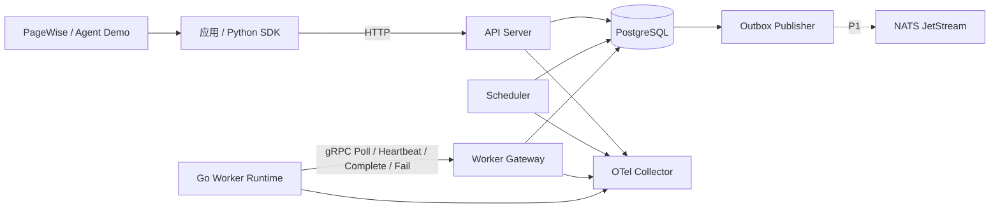
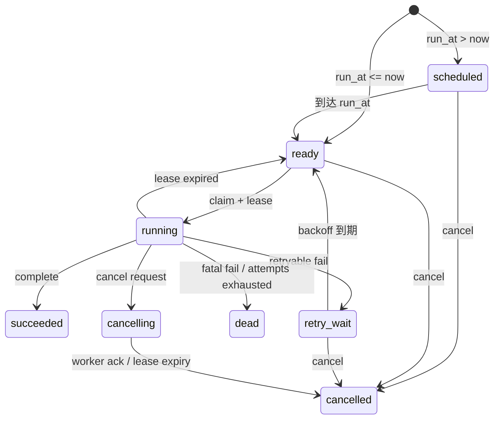

# JobForge：面向 Agent 工作负载的分布式任务编排平台 PRD

> 文档版本：v0.1  
> 文档状态：Draft / 可进入 S0 评审  
> 创建日期：2026-07-29  
> 计划周期：7–8 周；可裁剪为 6 周核心版  
> 项目形态：独立 Go 项目，不属于 PageWise 代码库  
> 目标用途：后端 / Agent 应用开发实习作品集

---

## 0. 决策摘要

JobForge 是一个面向 Agent、RAG 和通用后台任务的可靠执行平台。它使用 PostgreSQL 保存任务、状态与租约，使用 Go 实现控制面和 Worker 运行时，通过 gRPC 管理跨进程 Worker，并提供重试、死信队列、幂等、取消、崩溃恢复、多租户隔离、可观测性和性能测试。

本 PRD 固定以下实现边界：

1. **交付语义为 at-least-once，不承诺 exactly-once。** 外部副作用通过业务幂等保证只生效一次。
2. **默认自研 PostgreSQL 队列内核。** 如果 W1 结束时无法通过并发领取验收，则切换 River 作为底座；控制面、gRPC、多租户、观测和故障测试仍由本项目实现。
3. **PostgreSQL 是 P0 唯一事实源。** JetStream 只作为 P1 状态事件适配器，不进入核心任务状态事务。
4. **Agent 是真实业务负载，不是重新实现 Agent 框架。** PageWise 的索引重建或 Agent 评测用于集成演示；JobForge 保持通用接口与独立部署。
5. **不自研共识协议。** Scheduler 主节点使用 PostgreSQL advisory lock 实现单活与切换。
6. **先交付可靠执行，再做 UI。** 完整管理后台、复杂工作流画布和 Kubernetes 部署均不属于 P0。

## 1. 背景与问题

PageWise 已能证明 Python、FastAPI、SSE、RAG、Agent 产品体验、恢复机制和自动化测试，但无法证明以下后端基础设施能力：

- Go 并发编程与 goroutine 生命周期管理；
- 跨进程 Worker、gRPC 和接口版本演进；
- 数据库锁、任务租约和并发领取；
- 重试、DLQ、幂等、取消竞争和崩溃恢复；
- 多租户限流、背压与故障隔离；
- trace、metrics、pprof 和可复现压测。

现有 Agent/RAG 系统还存在一类通用问题：耗时任务不能可靠地绑在一次 HTTP 请求或单个应用进程上执行。Worker 崩溃、网络断开或服务重启后，任务必须能够恢复；重复投递不能造成重复业务副作用；运营者需要看到每次 attempt、失败原因和恢复路径。

JobForge 用一个独立项目补齐上述证据，并为 PageWise 或其他 Agent 应用提供通用异步执行能力。

## 2. 产品定位

### 2.1 一句话定位

为 Agent、RAG 和后台服务提供可恢复、可观测、可隔离的分布式任务执行底座。

### 2.2 目标用户

| 用户 | 核心诉求 |
|---|---|
| 应用开发者 | 通过 HTTP 或 Python SDK 提交、查询、取消任务，不关心 Worker 所在进程 |
| Worker 开发者 | 注册明确的任务类型，获得租约、取消信号、deadline 和重试上下文 |
| 系统维护者 | 查看队列积压、attempt 时间线、Worker 健康、DLQ 和性能指标 |
| 项目评审者 / 面试官 | 从代码、测试和报告中验证并发、可靠性、故障模型与性能证据 |

### 2.3 典型场景

1. PageWise 提交文档索引重建任务，任务执行进程被杀死后由其他 Worker 恢复。
2. Agent 评测批次包含多个耗时样本，系统按租户配额并发执行并汇总结果。
3. HTTP 回调任务在发送成功、ACK 前崩溃，系统发生重复投递，但幂等键阻止重复副作用。
4. Worker 失联导致租约过期，旧 Worker 恢复后提交完成结果，被 fencing token 拒绝。
5. 任务连续失败并达到最大次数后进入 DLQ，维护者修复原因后执行人工重试。

## 3. 目标、成功标准与非目标

### 3.1 产品目标

| ID | 目标 |
|---|---|
| G-01 | 实现一个可独立运行的 Go 分布式任务平台，覆盖任务全生命周期 |
| G-02 | 明确定义并验证 at-least-once、租约、幂等、fencing、重试和取消语义 |
| G-03 | 支持真实 Agent/RAG 工作负载，同时保持通用任务接口 |
| G-04 | 提供可复现的故障测试、race 检测、trace、profile 和 benchmark 报告 |
| G-05 | 在 7–8 周内形成可演示、可阅读、可写入简历的完整作品集证据 |

### 3.2 发布成功标准

P0 发布必须同时满足：

- 所有 P0 功能需求通过验收；
- `go test -race ./...` 无数据竞争；
- Worker kill、ACK 前崩溃、租约过期、旧 Worker 晚到、取消竞争、Scheduler 切换均有自动化测试；
- 故障注入测试中无任务静默丢失；
- 幂等测试中重复业务副作用为 0；
- 发布可复现的吞吐、p50/p95/p99、恢复时间、CPU、heap 和 goroutine 数据；
- Docker Compose 一条命令启动 PostgreSQL、API、Scheduler、Worker 和观测组件；
- 至少完成一个 PageWise 索引重建或 Agent 评测集成演示；
- README、架构图、故障矩阵、benchmark 报告和 3 分钟演示脚本齐全。

### 3.3 非目标

以下内容不属于本版本：

- 复刻 Temporal 的 Workflow History、确定性重放和完整 Workflow DSL；
- 自研 Raft/Paxos、分布式日志或数据库存储引擎；
- 宣称 exactly-once delivery；
- 允许用户上传并执行任意代码；
- 构建完整低代码工作流画布；
- 实现模型训练、模型网关或通用 Agent 框架；
- 在 P0 中实现完整 Kubernetes Operator、跨地域容灾或多集群调度；
- 将 PageWise 代码迁移或重写为 Go。

## 4. 版本范围

### 4.1 P0：核心发布范围

| 模块 | P0 范围 |
|---|---|
| 任务生命周期 | 提交、延迟执行、优先级、领取、心跳、完成、失败、取消、人工重试 |
| 可靠性 | lease、fencing token、指数退避与 jitter、DLQ、幂等键、崩溃恢复 |
| Worker | Go goroutine pool、context 取消、deadline、优雅退出、注册式 Handler |
| 通信 | HTTP 控制面；gRPC Worker 协议 |
| 调度 | scheduled/retry_wait 扫描；PostgreSQL advisory-lock 单活 Scheduler |
| 多租户 | tenant_id、租户级并发上限、队列级背压、基本隔离指标 |
| Agent 接入 | HTTP/Python SDK；PageWise 索引重建或 Agent 评测 Demo |
| 可观测性 | 结构化日志、核心 metrics、跨服务 trace、pprof |
| 工程化 | migration、Compose、单元/集成/故障/竞态/benchmark 测试 |

### 4.2 P1：时间允许时扩展

| 模块 | P1 范围 |
|---|---|
| 多租户治理 | 加权公平调度、令牌桶限流、更细粒度配额与拒绝策略 |
| 事件扩展 | JetStream 状态事件适配器、ACK/AckWait/重投实验 |
| 运维界面 | 最小任务列表、attempt 时间线、DLQ 操作页 |
| 调度扩展 | cron/周期任务、队列暂停与恢复 |
| 安全增强 | Worker mTLS、密钥轮换、payload 加密策略 |

### 4.3 六周裁剪规则

如果总周期被压缩为 6 周，按以下顺序裁剪：

1. 删除 JetStream；
2. 删除完整管理后台，只保留 CLI 或最小只读页面；
3. 多租户治理只保留租户并发上限和队列背压；
4. 不实现 cron；
5. 保留 lease、fencing、幂等、取消、重试/DLQ、恢复、race 检测和压测。

## 5. 系统架构



### 5.1 组件职责

| 组件 | 职责 | 不负责 |
|---|---|---|
| API Server | 提交、查询、取消、人工重试、鉴权与参数校验 | 执行业务任务 |
| Scheduler | 将 scheduled/retry_wait 推进为 ready；回收过期租约 | 存储业务结果 |
| Worker Gateway | gRPC Worker 会话、领取、心跳、完成和失败事务 | 运行用户 Handler |
| Go Worker Runtime | 并发池、Handler 注册、context、超时、取消和优雅退出 | 决定任务最终状态 |
| PostgreSQL | 任务状态、租约、attempt、Worker、outbox 的唯一事实源 | 执行任意业务代码 |
| Outbox Publisher | P1 发布状态事件并记录发送进度 | 改写任务核心状态 |
| Python SDK | 提交、查询、取消任务并透传 trace | 复制服务端调度逻辑 |

### 5.2 部署边界

- API Server、Scheduler、Worker Gateway 可以先部署为一个 Go 二进制的不同子命令，避免过早拆分微服务。
- Worker Runtime 独立进程运行，可启动多个实例。
- PostgreSQL 为唯一强依赖。
- OTel Collector、Prometheus/Grafana 和 JetStream 均通过 Compose 可选启用。

## 6. 核心数据模型

### 6.1 `jobs`

| 字段 | 类型 | 说明 |
|---|---|---|
| id | UUID | 任务唯一标识 |
| tenant_id | TEXT/UUID | 租户标识，由鉴权上下文确定 |
| queue | TEXT | 逻辑队列名称 |
| type | TEXT | 注册的任务类型，如 `pagewise.reindex` |
| payload | JSONB | 任务参数；P0 上限 256 KiB |
| priority | SMALLINT | 优先级，数值越大越优先 |
| state | ENUM/TEXT | 当前状态 |
| run_at | TIMESTAMPTZ | 最早可执行时间 |
| attempt | INT | 已开始的 attempt 次数 |
| max_attempts | INT | 最大执行次数 |
| timeout_seconds | INT | 单次执行超时 |
| idempotency_key | TEXT | 租户范围内的提交幂等键 |
| lease_owner | TEXT | 当前 Worker ID |
| lease_until | TIMESTAMPTZ | 当前租约过期时间 |
| fencing_token | BIGINT | 每次领取递增，拒绝旧 Worker 写入 |
| cancel_requested_at | TIMESTAMPTZ | 运行中取消请求时间 |
| trace_id | TEXT | 跨服务 trace 关联标识 |
| state_version | BIGINT | 乐观并发控制版本 |
| created_at / updated_at | TIMESTAMPTZ | 审计时间 |

建议索引：

- claim 部分索引：`(queue, state, run_at, priority DESC, created_at)`；
- 过期租约索引：`(state, lease_until)`；
- 查询索引：`(tenant_id, created_at DESC)`；
- 提交幂等唯一约束：`(tenant_id, idempotency_key)`，仅对非空键生效。

### 6.2 `job_attempts`

记录每次领取与执行：job_id、attempt_no、worker_id、fencing_token、started_at、finished_at、outcome、error_code、error_message、duration_ms、trace_id。

### 6.3 `workers`

记录 worker_id、instance_id、supported_types、queues、capacity、inflight、last_heartbeat_at、status、started_at、version。

### 6.4 `outbox_events`

记录 event_id、aggregate_id、event_type、payload、created_at、published_at、publish_attempts。P0 可只落表；P1 再发布到 JetStream。

## 7. 状态机与并发规则

### 7.1 状态定义

| 状态 | 含义 |
|---|---|
| scheduled | 等待 `run_at` |
| ready | 可被 Worker 领取 |
| running | 已被有效租约持有 |
| cancelling | 运行中已收到取消请求，等待 Worker 停止或租约过期 |
| retry_wait | 失败后等待下次重试时间 |
| succeeded | 终态：成功 |
| dead | 终态：超过最大次数或不可重试 |
| cancelled | 终态：已取消 |



### 7.2 强制并发规则

1. **领取事务**必须使用 `FOR UPDATE SKIP LOCKED`，在同一事务内更新 lease_owner、lease_until、attempt、fencing_token 和 state。
2. **Heartbeat、Complete、Fail**必须同时匹配 job_id、lease_owner、fencing_token 和允许的当前状态。
3. 旧 Worker 使用过期 fencing token 写入时，服务端返回 `STALE_LEASE`，不得改变任务状态。
4. 等待态取消立即进入 cancelled；running 取消先进入 cancelling，并通过 heartbeat 控制消息传播。
5. Complete 与 Cancel 竞争时采用“事务先提交者生效”：
   - Complete 先提交：最终 succeeded；后续取消返回 `ALREADY_TERMINAL`。
   - Cancel 先提交：进入 cancelling；后续 Complete 返回 `CANCEL_REQUESTED`，不得写成 succeeded。
6. cancelling 状态下 Fail 不触发重试，最终进入 cancelled。
7. lease 过期回收时：running 回到 ready；cancelling 进入 cancelled。
8. 任何终态转换必须追加 `job_attempts` 记录，并在同一事务写入 outbox event。

## 8. 执行与重试语义

### 8.1 交付保证

- JobForge 保证任务在未进入终态前可再次被投递，即 **at-least-once**。
- Worker 在完成外部副作用后、Complete RPC 前崩溃时，任务可能被重复执行。
- JobForge 不把“任务只被领取一次”等同于“业务副作用只发生一次”。

### 8.2 业务幂等

- 提交幂等：相同 tenant_id + idempotency_key 返回已有 job_id，不重复创建任务。
- 执行幂等：Handler 必须使用 job_id 或业务幂等键保护外部副作用。
- Demo 至少实现一个幂等结果表，并通过重复投递测试证明副作用计数不重复。

### 8.3 重试

- 默认最大执行次数：3，可在 1–10 之间配置。
- 退避：`min(base × 2^(attempt-1) + full_jitter, max_backoff)`。
- 默认 base 1 秒、max_backoff 5 分钟；测试环境可缩短。
- 参数错误、未知任务类型和明确业务拒绝属于不可重试错误。
- 网络超时、临时依赖不可用和 Worker 异常退出属于可重试错误。
- 达到 max_attempts 后进入 dead。

## 9. 功能需求

### 9.1 任务控制面

| ID | 优先级 | 需求 | 验收标准 |
|---|---|---|---|
| FR-001 | P0 | 创建即时或延迟任务 | 合法请求返回 job_id；相同幂等键返回同一任务；非法 type/payload 被拒绝 |
| FR-002 | P0 | 查询任务详情与 attempt 时间线 | 返回当前状态、租约摘要、attempt、错误和关键时间；不暴露其他租户任务 |
| FR-003 | P0 | 按状态、队列、类型分页查询 | 游标分页稳定；默认按 created_at 倒序；limit 有上限 |
| FR-004 | P0 | 取消等待中或运行中的任务 | 等待态立即取消；运行态进入 cancelling 并传播取消信号 |
| FR-005 | P0 | 对 dead/cancelled 任务人工重试 | 创建新的 attempt 或克隆为新任务，必须记录操作来源；succeeded 不允许重试 |

### 9.2 Worker 与可靠执行

| ID | 优先级 | 需求 | 验收标准 |
|---|---|---|---|
| FR-101 | P0 | Worker 注册支持的 queue/type 与容量 | 不支持任务类型的 Worker 不会收到该任务 |
| FR-102 | P0 | 多 Worker 并发领取 | 两个以上 Worker 并发时，同一 fencing token 只属于一个 Worker |
| FR-103 | P0 | Heartbeat 延长有效租约 | 只有 owner + token 匹配时可以延长；过期 token 被拒绝 |
| FR-104 | P0 | Complete/Fail 原子更新 | 状态、attempt 和 outbox 在同一事务提交 |
| FR-105 | P0 | Worker 优雅退出 | 停止领取新任务；在宽限期内完成或取消进行中任务；无 goroutine 泄漏 |
| FR-106 | P0 | Worker 崩溃恢复 | lease 过期后任务可重新领取；旧 Worker 结果不能覆盖新状态 |
| FR-107 | P0 | 重试与 DLQ | 可重试错误按退避重新入队；超限或 fatal 错误进入 dead |
| FR-108 | P0 | context deadline/cancel | Handler 收到 deadline 与取消；取消结果遵循状态竞争规则 |

### 9.3 调度与高可用

| ID | 优先级 | 需求 | 验收标准 |
|---|---|---|---|
| FR-201 | P0 | scheduled/retry_wait 到期推进 | 到期任务在一次扫描周期内进入 ready；重复扫描不重复推进 |
| FR-202 | P0 | 过期 lease 回收 | running 回到 ready；cancelling 进入 cancelled；写入恢复事件 |
| FR-203 | P0 | Scheduler 单活 | 只有持有 PostgreSQL advisory lock 的实例执行扫描 |
| FR-204 | P0 | Scheduler 切换 | 主实例终止后备用实例自动接管；旧实例不能继续调度 |

### 9.4 多租户与背压

| ID | 优先级 | 需求 | 验收标准 |
|---|---|---|---|
| FR-301 | P0 | 所有任务绑定 tenant_id | tenant_id 来自鉴权上下文；客户端不能越权覆盖 |
| FR-302 | P0 | 租户并发上限 | 租户达到 inflight 上限后暂停为其领取新任务 |
| FR-303 | P0 | 队列背压 | 队列积压超过软阈值时产生告警；超过硬阈值时提交返回明确错误 |
| FR-304 | P1 | 加权公平调度 | 高负载租户不能长期饿死其他有配额的租户 |
| FR-305 | P1 | 租户令牌桶限流 | 限流命中有指标和明确的 retry_after |

### 9.5 Agent 与 SDK 接入

| ID | 优先级 | 需求 | 验收标准 |
|---|---|---|---|
| FR-401 | P0 | 提供最小 Python SDK | 支持 submit/get/cancel/retry；超时和错误类型明确 |
| FR-402 | P0 | 提供通用 Demo Handler | 包含 echo、sleep、http、fail、idempotent_effect |
| FR-403 | P0 | 接入一个真实 Agent/RAG 任务 | PageWise 索引重建或 Agent 评测可异步提交、观察、取消和恢复 |
| FR-404 | P1 | MCP/Agent 工具适配器 | 只做薄适配，不把 MCP 作为核心调度协议 |

### 9.6 可观测性与运维

| ID | 优先级 | 需求 | 验收标准 |
|---|---|---|---|
| FR-501 | P0 | 结构化日志 | 每条关键日志含 job_id、tenant_id、attempt、worker_id、trace_id |
| FR-502 | P0 | 核心 metrics | 可观察提交、领取、成功、失败、重试、DLQ、过期租约、积压和延迟 |
| FR-503 | P0 | 分布式 trace | 一次任务可串联 API → Scheduler/Gateway → Worker Handler |
| FR-504 | P0 | pprof | 可采集 CPU、heap、goroutine profile，默认不暴露到公网 |
| FR-505 | P1 | 最小管理界面 | 支持任务列表、attempt 时间线和 DLQ 人工操作 |

## 10. API 契约

### 10.1 HTTP API

#### `POST /v1/jobs`

请求：

```json
{
  "queue": "agent-eval",
  "type": "pagewise.evaluate",
  "payload": {"dataset_id": "demo-001"},
  "priority": 10,
  "run_at": null,
  "max_attempts": 3,
  "timeout_seconds": 300,
  "idempotency_key": "eval-demo-001-v1"
}
```

响应：`202 Accepted`

```json
{
  "job_id": "uuid",
  "state": "ready",
  "deduplicated": false
}
```

#### 其他端点

| 方法 | 路径 | 用途 |
|---|---|---|
| GET | `/v1/jobs/{job_id}` | 查询任务与 attempt 摘要 |
| GET | `/v1/jobs` | 按 state/queue/type/cursor/limit 查询 |
| POST | `/v1/jobs/{job_id}:cancel` | 请求取消 |
| POST | `/v1/jobs/{job_id}:retry` | 人工重试 dead/cancelled 任务 |
| GET | `/health/live` | 进程存活检查 |
| GET | `/health/ready` | PostgreSQL、migration 与服务就绪检查 |

统一错误码至少包括：`INVALID_ARGUMENT`、`UNAUTHORIZED`、`FORBIDDEN`、`NOT_FOUND`、`CONFLICT`、`QUEUE_OVERLOADED`、`ALREADY_TERMINAL`、`INTERNAL`。

### 10.2 gRPC Worker API

| RPC | 方向 | 关键字段 | 语义 |
|---|---|---|---|
| Register | Worker → Server | worker_id、queues、types、capacity、version | 注册或刷新 Worker 能力 |
| Poll | Worker → Server | worker_id、max_jobs、available_capacity | 长轮询领取任务租约 |
| Heartbeat | 双向流 | job_id、worker_id、fencing_token、progress | 延长租约并返回 continue/cancel 控制信号 |
| Complete | Worker → Server | job_id、token、result_ref、duration | 提交成功结果 |
| Fail | Worker → Server | job_id、token、error_code、retryable | 提交失败并触发 retry/dead |

协议要求：

- 所有 RPC 必须传递 deadline；
- Complete/Fail 必须幂等；
- proto 包使用 `jobforge.worker.v1`；
- 只允许向后兼容地新增字段；
- 未知字段不得导致旧服务崩溃。

## 11. 非功能需求

### 11.1 正确性与可靠性

| ID | 要求 |
|---|---|
| NFR-001 | 100 轮 Worker kill 故障注入中，非终态任务不得静默丢失 |
| NFR-002 | 10,000 个包含重复投递的幂等测试任务，重复业务副作用数必须为 0 |
| NFR-003 | 任务恢复上界不超过 `lease_ttl + scan_interval + 2s`（同机测试环境） |
| NFR-004 | Scheduler 接管时间不超过 `2 × lock_retry_interval + 2s` |
| NFR-005 | `go test -race ./...` 无数据竞争 |
| NFR-006 | 所有状态转换均有审计 attempt 或事件记录 |

### 11.2 性能

绝对吞吐受硬件影响，P0 不在编码前虚构数字。采用冻结基线的发布门禁：

1. W4 固定 benchmark 环境、PostgreSQL 配置、任务 payload 和并发数；
2. 发布时公开 enqueue/claim 吞吐与端到端 p50/p95/p99；
3. 相同环境下，P0 最终吞吐相对 W4 基线不得下降超过 15%；
4. 控制面 p95 相对 W4 基线不得恶化超过 20%；
5. 10,000 个 no-op 任务完成并等待 60 秒后，goroutine 数应回到测试前 ±5% 范围；
6. 所有数字必须附带 CPU、内存、Go/PostgreSQL 版本和测试命令。

### 11.3 可维护性

- `go vet ./...`、格式化、静态检查和测试纳入 CI；
- 数据库变更只通过 versioned migration；
- 核心状态转换集中在 domain/service 层，不分散在 HTTP/gRPC handler；
- 时间、随机数和重试策略必须可注入，便于确定性测试；
- public API 与 proto 必须有最小契约测试。

### 11.4 安全

- P0 使用 API key 映射 tenant_id；不得相信请求体中的 tenant_id；
- Worker 使用独立凭据；P1 再升级 mTLS；
- payload 上限 256 KiB，不允许保存明文密钥；
- 只运行预注册 Handler，不提供任意 shell/code 执行；
- pprof、metrics 和管理端点只绑定内网或 localhost；
- 日志不得记录完整敏感 payload、API key 或 Authorization header。

## 12. 可观测性规范

### 12.1 核心指标

| 指标 | 类型 | 关键标签 |
|---|---|---|
| `jobforge_jobs_submitted_total` | Counter | tenant、queue、type |
| `jobforge_job_attempts_total` | Counter | queue、type、outcome |
| `jobforge_queue_depth` | Gauge | tenant、queue、state |
| `jobforge_job_latency_seconds` | Histogram | queue、type、outcome |
| `jobforge_claim_duration_seconds` | Histogram | queue |
| `jobforge_retries_total` | Counter | queue、error_code |
| `jobforge_dlq_total` | Counter | queue、type |
| `jobforge_lease_expired_total` | Counter | queue |
| `jobforge_workers_active` | Gauge | version、status |
| `jobforge_tenant_throttled_total` | Counter | tenant、reason |

高基数字段 job_id、trace_id 不得作为 metrics label，只进入日志和 trace。

### 12.2 Trace Span

最少包含：`http.submit_job`、`scheduler.promote_jobs`、`gateway.claim_jobs`、`worker.execute`、`gateway.complete_job`。Span 属性包括 queue、type、attempt、worker_id、tenant_id；不得包含完整 payload。

## 13. 验收测试矩阵

| ID | 场景 | 操作 | 预期结果 |
|---|---|---|---|
| AT-01 | 并发领取 | 两个 Worker 同时 claim 同一批任务 | 每个 fencing token 只有一个 owner |
| AT-02 | 执行后 ACK 前崩溃 | Handler 写入幂等结果后 kill Worker | 任务重投；业务副作用仍只有一次 |
| AT-03 | 旧 Worker 晚到 | lease 过期并被新 Worker 领取后，旧 Worker Complete | 返回 STALE_LEASE；新状态不被覆盖 |
| AT-04 | Heartbeat 丢失 | 阻断 Worker 网络直到 lease 过期 | 任务恢复；旧 Worker 后续写入被拒绝 |
| AT-05 | Cancel 先提交 | running 时提交 cancel，再 Complete | 状态进入 cancelling/cancelled；Complete 被拒绝 |
| AT-06 | Complete 先提交 | Complete 提交后再 cancel | 状态保持 succeeded；cancel 返回 ALREADY_TERMINAL |
| AT-07 | 重试退避 | 连续返回 retryable error | retry_wait 时间符合退避区间，最终成功或 dead |
| AT-08 | DLQ 人工恢复 | 任务进入 dead 后修复条件并 retry | 产生审计记录并重新执行 |
| AT-09 | Scheduler 切换 | 启动双 Scheduler，kill leader | follower 接管；任务只推进一次 |
| AT-10 | 租户隔离 | 租户 A 填满并发配额，租户 B 提交任务 | B 仍能在自身配额内执行 |
| AT-11 | 优雅退出 | Worker 收到 SIGTERM | 停止领取；进行中任务完成或安全释放 |
| AT-12 | Trace 串联 | 提交一个真实 Agent 任务 | API、Gateway、Worker span 可在同一 trace 查看 |

## 14. 里程碑与退出条件

| 阶段 | 时间 | 交付物 | 退出条件 |
|---|---:|---|---|
| S0：契约与状态机 | 2–3 天 | ADR、状态机、错误分类、HTTP/proto 草案 | 本 PRD 中的执行、取消、租约和幂等语义无未决冲突 |
| W1：PostgreSQL 队列内核 | 1 周 | migration、enqueue/claim/complete/fail | AT-01 通过；解释查询计划与索引；触发范围闸门 |
| W2：Go Worker Runtime | 1 周 | 并发池、Handler、heartbeat、优雅退出 | AT-04、AT-11 通过；race 检测通过 |
| W3：可靠执行语义 | 1 周 | 重试、DLQ、幂等、fencing、取消 | AT-02、AT-03、AT-05～08 通过 |
| W4：gRPC 与 Scheduler HA | 1 周 | Worker proto、advisory-lock leader、基线压测 | AT-09 通过；冻结 benchmark 基线 |
| W5：Agent 接入与租户隔离 | 1 周 | Python SDK、真实 Demo、基本配额/背压 | AT-10、AT-12 通过；真实任务可取消和恢复 |
| W6：观测与事件扩展 | 1 周 | OTel、pprof、故障仪表；可选 JetStream | trace 完整；profile 能解释至少一个热点 |
| W7：作品集交付 | 1 周 | 最终 benchmark、故障报告、Compose、README、演示 | 全部 P0 门禁通过；简历材料可直接使用 |

### 14.1 W1 范围闸门

W1 结束时检查：

- 多 Worker `SKIP LOCKED` 领取测试是否稳定；
- lease、事务边界和索引是否能够清晰解释；
- 队列内核代码是否已经挤压后续可靠性和 Agent 接入时间。

若任一关键项失败，W2 开始前切换 River。切换后仍必须自己实现：Worker Gateway、gRPC 协议、fencing 验证、取消语义、多租户控制、Agent 接入、观测、故障测试和 benchmark。

## 15. 测试策略

| 层级 | 内容 |
|---|---|
| 单元测试 | 状态转换、错误分类、退避算法、配额计算、Handler 生命周期 |
| 数据库集成测试 | claim SQL、并发事务、租约回收、幂等约束、outbox 原子性 |
| gRPC 契约测试 | proto 兼容、deadline、重复 Complete/Fail、错误码 |
| 故障注入测试 | kill Worker、断网、延迟 heartbeat、kill Scheduler、重复投递 |
| 竞态与泄漏测试 | `go test -race`、goroutine 稳态检查、取消风暴 |
| 性能测试 | enqueue、claim、端到端、不同 Worker 数、不同 payload 与队列深度 |
| Demo 验收 | 通用任务 + PageWise/Agent 真实任务的提交、取消、恢复和追踪 |

测试必须使用真实 PostgreSQL 容器；核心可靠性测试不得只依赖 mock。

## 16. 风险与应对

| 风险 | 可能影响 | 应对 |
|---|---|---|
| 自研队列内核耗时过长 | 后续功能无法完成 | W1 范围闸门；及时切换 River |
| 错把 at-least-once 宣传成 exactly-once | 技术可信度下降 | 文档、API 和 Demo 明确区分投递与业务副作用 |
| PostgreSQL claim 热点 | 吞吐下降、锁竞争 | 部分索引、批量领取、短事务、EXPLAIN 与 profile |
| 取消语义不清 | 任务已取消但仍产生副作用 | cancelling 状态、context 传播、状态版本与幂等 Handler |
| PageWise 耦合过深 | 第二项目无法独立展示 | 通用 API/SDK；真实 Demo 作为 adapter 存在 |
| UI 占用核心工期 | 可靠性证据不足 | P0 只做 CLI/只读最小页；UI 排 P1 |
| JetStream 引入双事实源 | 状态不一致 | PostgreSQL 永远是事实源；只从 outbox 发布状态事件 |
| 指标标签基数失控 | 观测成本和性能恶化 | job_id/trace_id 只用于日志与 trace |

## 17. 交付清单

代码仓库最终至少包含：

- `cmd/api`、`cmd/scheduler`、`cmd/worker`；
- `internal/domain`、`internal/store/postgres`、`internal/gateway/grpc`；
- `proto/jobforge/worker/v1`；
- `sdk/python`；
- `migrations`；
- `tests/integration`、`tests/fault`、`benchmarks`；
- `deploy/compose.yaml`；
- `docs/architecture.md`、`docs/failure-semantics.md`、`docs/benchmark.md`；
- README、架构图、状态机、故障矩阵和演示脚本。

## 18. 三分钟演示脚本

1. 用 Compose 启动 PostgreSQL、JobForge 和两个 Worker。
2. 提交普通任务与 PageWise/Agent 真实任务，展示 job_id、attempt 和 trace。
3. 在任务运行中 kill 当前 Worker。
4. 展示 lease 过期后另一 Worker 重新领取。
5. 让旧 Worker 模拟晚到 Complete，展示 `STALE_LEASE`。
6. 展示幂等结果表中业务副作用只出现一次。
7. 让另一个任务连续失败进入 DLQ，再执行人工重试。
8. 打开 benchmark 与 pprof 结果，解释一个实际瓶颈和优化前后变化。

## 19. Definition of Done

一个需求只有同时满足以下条件才算完成：

- 代码、migration 和接口契约已提交；
- 单元或集成测试覆盖正常路径与至少一个失败路径；
- 并发相关需求通过 race 检测；
- 新增状态、错误或指标已写入文档；
- 可在 Compose 环境复现；
- 没有引入与本 PRD 冲突的执行语义；
- README 或演示步骤已同步更新。

## 20. S0 评审清单

S0 结束前只需要确认以下实现参数，不再改变产品边界：

1. 默认 lease TTL、heartbeat 间隔和 Scheduler scan interval；
2. P0 的 API key 存储方式与本地开发凭据；
3. PageWise 首个 Demo 选择“索引重建”还是“Agent 评测”；
4. Worker Poll 使用 unary long-poll 还是 server streaming；
5. dead 任务人工重试采用“复用 job_id 新增 attempt”还是“克隆新 job_id”。

建议默认值：lease TTL 30 秒、heartbeat 10 秒、scan interval 1 秒；P0 使用 unary long-poll；人工重试克隆新 job_id 并记录 `retry_of_job_id`，以保持原任务终态不可变。

---

## 附录 A：建议的首批任务类型

| type | 用途 | 是否要求业务幂等 |
|---|---|---|
| `demo.echo` | 最小连通性测试 | 否 |
| `demo.sleep` | 超时、取消、并发池测试 | 否 |
| `demo.fail` | 重试与 DLQ 测试 | 否 |
| `demo.http` | 外部依赖与临时错误测试 | 是 |
| `demo.idempotent_effect` | 重复投递与副作用验证 | 是 |
| `pagewise.reindex` | 文档索引重建 Demo | 是 |
| `pagewise.evaluate` | Agent/RAG 评测批次 Demo | 是 |

## 附录 B：简历证据映射

| 实现证据 | 可证明的能力 |
|---|---|
| goroutine pool、context、race、泄漏测试 | Go 并发与资源生命周期 |
| `SKIP LOCKED`、lease、索引与事务测试 | PostgreSQL 并发控制与队列设计 |
| gRPC Worker 协议与 fencing token | 跨进程协议、超时与陈旧写保护 |
| 重试、DLQ、幂等、故障注入 | 分布式系统可靠性与工程判断 |
| advisory-lock Scheduler 切换 | 高可用调度与边界控制 |
| 租户配额、限流、背压 | 平台治理与故障隔离 |
| OTel、pprof、benchmark | 可观测性与性能分析 |
| PageWise/Agent 真实接入 | Go 后端能力与 Agent 应用场景结合 |

